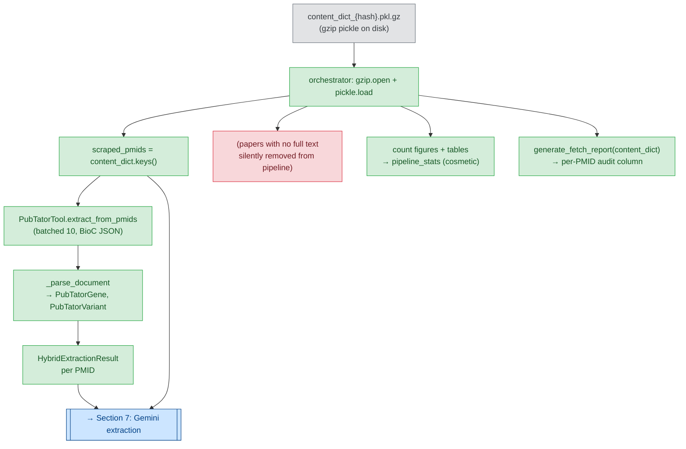
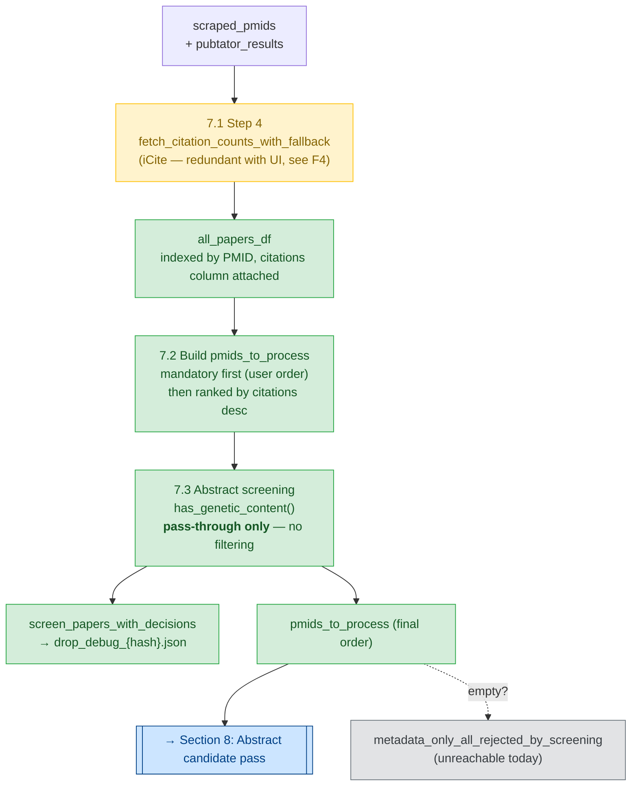
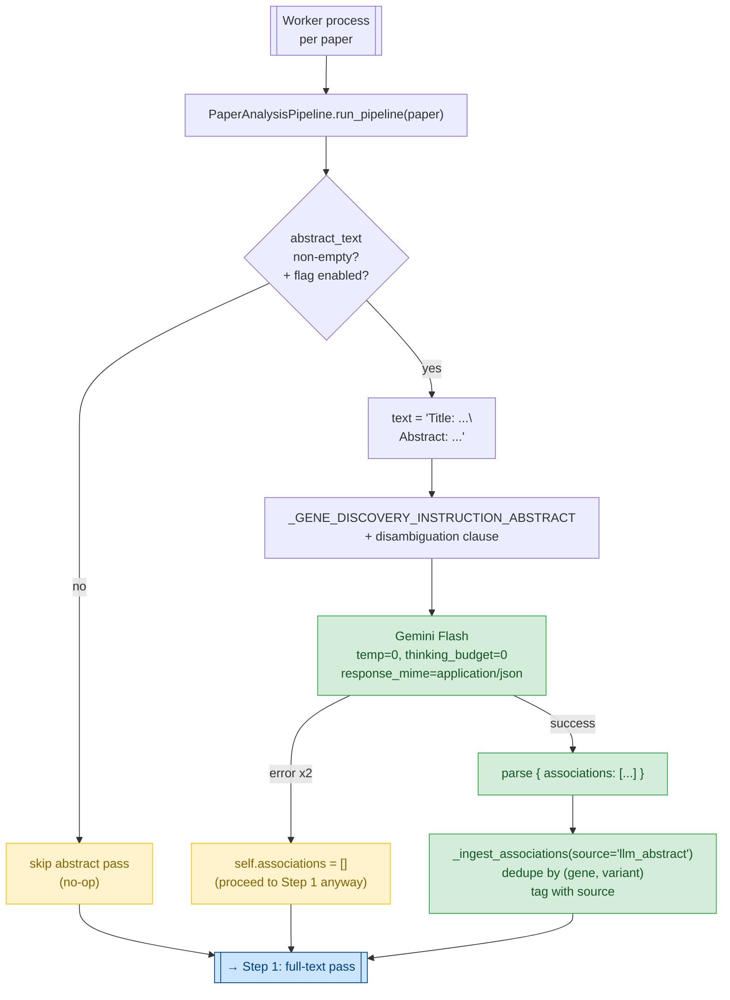
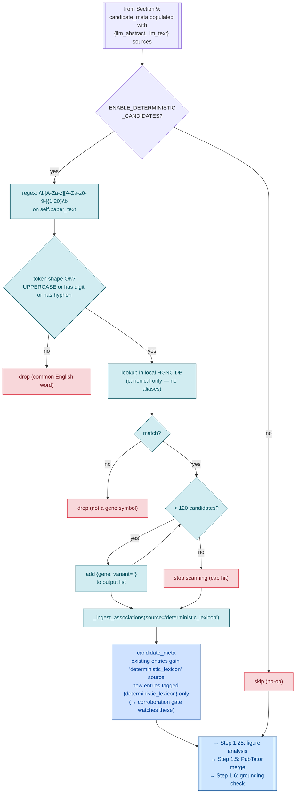
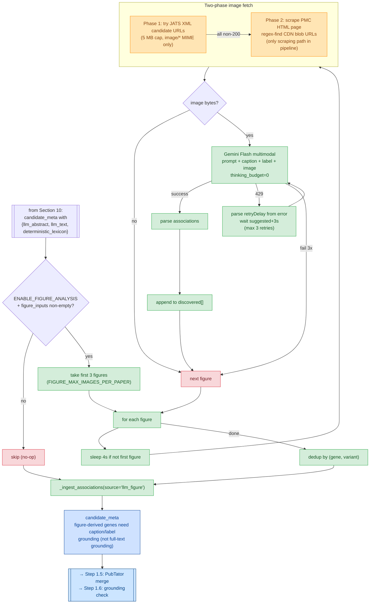
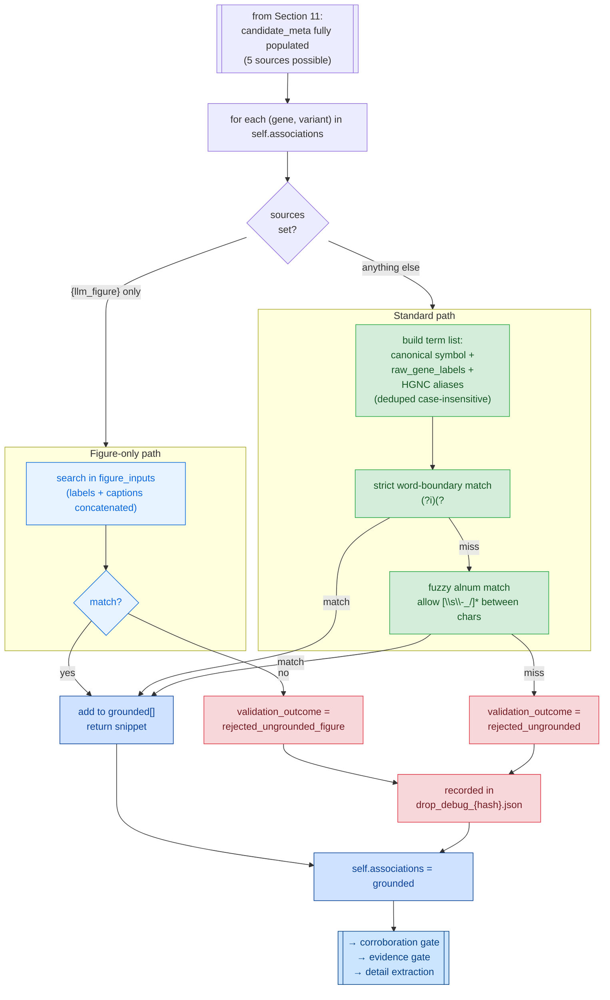
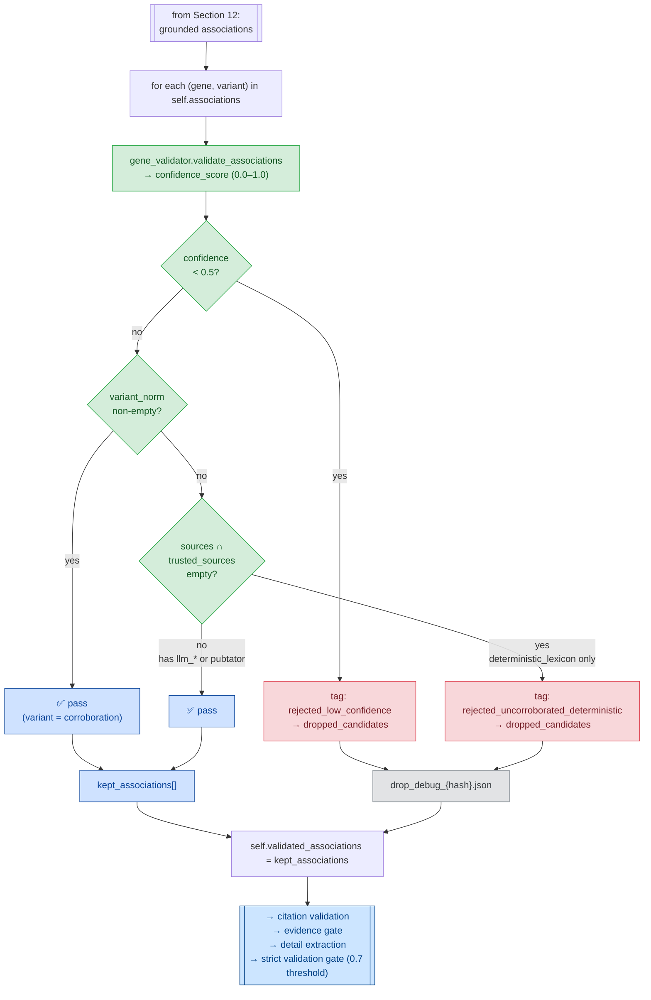
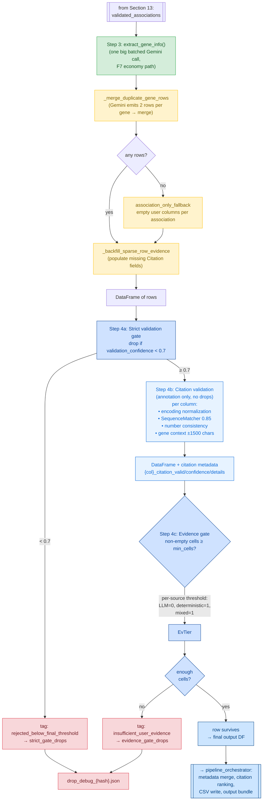
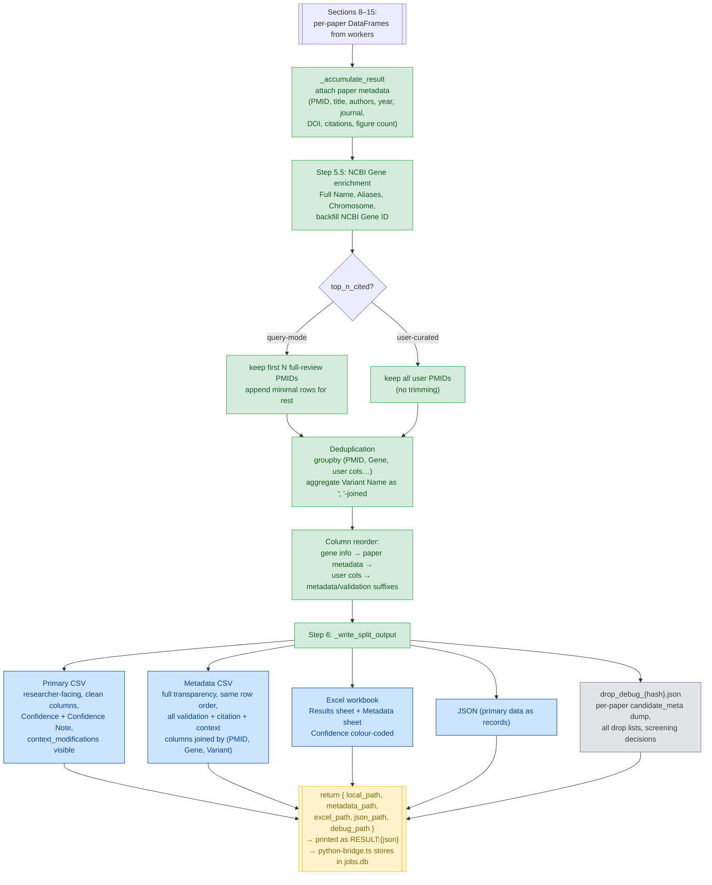

# Pipeline Understanding

> A working document built up step by step as we trace through the pipeline.
> Written collaboratively — each section reflects what has been discussed and verified.
> Not a spec. Not a reference. A shared mental model.

For the compact source-of-truth stage/function map, see
[`pipeline-step-table.md`](./pipeline-step-table.md).

---

## 1. Paper Selection — Handoff from UI to Pipeline

### What the user does

The user picks papers in the `TopicResultsModal` (opened from `QueryBuilder`). They can combine
three sources in the same run:

- **Topic search** — PMIDs returned from a PubMed query, curated via the selection modal
- **Specific PMIDs** — a hand-typed list
- **Author search** — PMIDs from an author lookup

Each source maintains its own selection state in `QueryBuilder.tsx`:
`topicPapers`, `specificPapers`, `authorPapers` — all arrays of `PaperItem`.

### What actually crosses the UI → pipeline boundary

When the user clicks "Run", [`QueryBuilder.tsx:156`](app/src/renderer/pages/QueryBuilder.tsx:156)
`handleRunPipeline()` flattens all three arrays into **one deduplicated PMID list**:

```ts
const allPmids = Array.from(new Set([
  ...topicPapers.map(p => p.pmid).filter(Boolean),
  ...specificPapers.map(p => p.pmid).filter(Boolean),
  ...authorPapers.map(p => p.pmid).filter(Boolean),
])) as string[]
```

That's it. **Everything else the UI computed is dropped**:
- Gene relevance score / tier / detected gene symbols
- Composite impact score
- Journal quality tier (Q1/Q2/Q3)
- Publication type badges (Review, Meta-Analysis)
- OA badge state
- Abstract text
- Why a paper was auto-selected vs manually chosen

The pipeline receives no rationale for the selection — just the PMIDs.

### How it reaches Python

[`python-bridge.ts:64`](app/src/main/python-bridge.ts:64) `startPipeline()` spawns
`python run_pipeline.py` as a child process. The PMIDs are passed as a JSON-encoded CLI arg:

```
--pmids '["34876594","20129251",...]'
```

Secrets (`GEMINI_API_KEY`, `ENTREZ_EMAIL`) go in via `env`, **never** as CLI args — they would
otherwise show up in `ps aux`. The parallel-analysis toggle is also passed via env
(`PARALLEL_ANALYSIS=true|false`).

On the Python side, [`run_pipeline.py:42`](pipeline/run_pipeline.py:42) parses `--pmids` with
`json.loads()` and hands the list to the orchestrator as `specific_pmids`.

### The key consequence

The pipeline is **selection-agnostic**. It doesn't know:
- Whether a paper was pre-screened as "high gene relevance" or manually overridden by the user
- Whether the user saw a "Review article" warning and selected it anyway
- Whether PMC full text was predicted to be available

This means every filter the pipeline applies downstream (OA check, full-text fetch success,
PubTator coverage, grounding check) runs independently of what the UI told the user — and any
per-paper expectation set by the UI is not re-validated inside the pipeline. If the UI said
"Full text" and PMC actually returns nothing, the pipeline silently degrades to abstract-only.

### What to remember for later sections

- `specific_pmids` is the pipeline's entry point — it's the name to grep for when tracing.
- `topN` defaults to `allPmids.length || 9999`. When the user picks papers explicitly, `topN`
  equals the count — there's no further trimming. `9999` is only used when no PMIDs are
  supplied (pure query-based run).
- The three-source merge happens **before** the pipeline starts, so the pipeline never sees
  the "topic vs specific vs author" distinction.

---

## 2. User-Defined List — A Worked Example

A "user-defined list" is the **Specific Papers** paste box on the Query Builder page —
rendered by [`SmartInput.tsx`](app/src/renderer/components/SmartInput.tsx). This is the entry
path for a researcher who already knows which papers they want to analyse.

### What the user types

The textarea accepts mixed formats on one or many lines, separated by newlines, commas, or
semicolons. A realistic example input:

```
12345678
PMID: 34876594
https://pubmed.ncbi.nlm.nih.gov/20129251/
PMC9035072
https://www.ncbi.nlm.nih.gov/pmc/articles/PMC9035072/
DOI: 10.1038/nature12373
10.1093/nar/gkab123
banana
```

The line "banana" is intentional — it's how we trace error paths.

### Step 1 — Parsing (`parseIdentifiers`, client-side only)

On click of **Validate**, `parseIdentifiers()` (a pure regex classifier, no network)
splits the text and tags each line as one of four types:

| Input line | Classified as | Value extracted |
|---|---|---|
| `12345678` | `pmid` | `12345678` |
| `PMID: 34876594` | `pmid` | `34876594` |
| `https://pubmed.ncbi.nlm.nih.gov/20129251/` | `pmid` | `20129251` |
| `PMC9035072` | `pmc` | `PMC9035072` |
| `https://www.ncbi.nlm.nih.gov/pmc/articles/PMC9035072/` | `pmc` | `PMC9035072` |
| `DOI: 10.1038/nature12373` | `doi` | `10.1038/nature12373` |
| `10.1093/nar/gkab123` | `doi` | `10.1093/nar/gkab123` |
| `banana` | `unknown` | `banana` |

Unknowns are collected into an `invalid` list and surfaced in the UI as "we couldn't parse
these" — they do not proceed.

### Step 2 — Enrichment (only PMIDs get looked up)

The validator then calls `window.api.pubmed.fetchDetails(pmids)` — an IPC round-trip to the
main process, which calls NCBI esummary and returns `{ title, doi, pmc, journal, url, ... }`
keyed by PMID.

**Only entries classified as `pmid` are enriched.** `doi` and `pmc` entries get a minimal
`PaperItem` with just a URL to the source page. No reverse lookup (DOI → PMID, PMC → PMID)
happens anywhere.

Result after validation:

```js
papers = [
  { pmid: '12345678',  title: '...', doi: '...', pmc: '...', url: '...', original: '12345678' },
  { pmid: '34876594',  title: '...', doi: '...', pmc: '...', url: '...', original: 'PMID: 34876594' },
  { pmid: '20129251',  title: '...', doi: '...', pmc: '...', url: '...', original: 'https://...' },
  { pmc:  'PMC9035072',                                    url: '...', original: 'PMC9035072' },
  { pmc:  'PMC9035072',                                    url: '...', original: 'https://...' },
  { doi:  '10.1038/nature12373',                           url: '...', original: 'DOI: ...' },
  { doi:  '10.1093/nar/gkab123',                           url: '...', original: '10.1093/...' },
]
```

The user sees all 7 parsed items in the validated-papers panel and clicks **"Use these"**.

### Step 3 — The silent filter

[`SmartInput.tsx:184`](app/src/renderer/components/SmartInput.tsx:184) `useValid()`:

```ts
const pmids = papers.filter((p) => p.pmid).map((p) => p.pmid!)
onPapersChange(pmids, papers)
```

The **DOI-only and PMC-only entries are dropped** — they have no `pmid` field. The call to
`onPapersChange` hands back **3 PMIDs** from the 7 validated papers. The user is not told.

This is a real gap: a user who pastes a valid PMC ID or DOI expects that paper to be analysed.
It won't be. (Worth a separate audit entry — adding as **F3** below.)

### Step 4 — Into `QueryBuilder` state

[`QueryBuilder.tsx:134`](app/src/renderer/pages/QueryBuilder.tsx:134)
`handleSpecificPapersChange(pmids, papers)` stores both:

```ts
setSpecificPmids(['12345678', '34876594', '20129251'])
setSpecificPapers(papers)  // all 7, for UI display
```

The UI shows the full validated list (including DOI/PMC items) back to the user — reinforcing
the false impression that all 7 will be processed.

### Step 5 — Final merge on "Run"

When the user clicks **Run**, [`QueryBuilder.tsx:161–167`](app/src/renderer/pages/QueryBuilder.tsx:161)
does its second filter:

```ts
const allPmids = Array.from(new Set([
  ...topicPapers.map(p => p.pmid).filter(Boolean),
  ...specificPapers.map(p => p.pmid).filter(Boolean),   // DOI/PMC-only items filtered again
  ...authorPapers.map(p => p.pmid).filter(Boolean),
])) as string[]
```

Only PMIDs survive. The `new Set([...])` also deduplicates (the two `PMC9035072` rows above
would have collapsed anyway if they'd resolved to a PMID).

### Step 6 — Spawn

[`python-bridge.ts:80`](app/src/main/python-bridge.ts:80) passes the 3 PMIDs as a JSON CLI
argument:

```
python run_pipeline.py \
  --query "" \
  --pmids '["12345678","34876594","20129251"]' \
  --authors '[]' \
  --columns '[...]' \
  --top-n 3 \
  --output-dir /path/to/output
```

Secrets go through `env`. See Section 1 for the security reasoning.

### Step 7 — Into the pipeline

[`pipeline_orchestrator.run_pipeline(specific_pmids=[...], query="", ...)`](pipeline/modules/pipeline_orchestrator.py:551):

- Line 685: `mandatory_pmids = set(specific_pmids)` — now `{'12345678', '34876594', '20129251'}`.
- Line 698–699: `initial_pmids.update(mandatory_pmids)` — they're guaranteed to be processed.
- Line 701: `if query:` — false in this case, so the PubMed relevance search (with its OA
  filter) is **skipped entirely**.
- Line 718: `fetch_paper_details(initial_pmids)` — NCBI esummary for each, populates metadata.
- Onward to full-text fetch, which assumes every PMID is OA (see finding **F2** in
  `docs/audit/final-audit.md` — it isn't).

### End-to-end summary

| Stage | Count in / count out | Note |
|---|---|---|
| User paste | 8 lines | 1 "banana" visibly rejected |
| `parseIdentifiers` | 8 → 7 classified | 3 PMID, 2 PMC, 2 DOI |
| `fetchDetails` | only 3 PMIDs enriched | DOIs/PMCs never resolved to PMIDs |
| `useValid` | 7 validated → 3 PMIDs passed up | **Silent drop of DOI/PMC-only** |
| `QueryBuilder.handleRun` | 3 PMIDs → pipeline | Second filter redundant but harmless |
| Pipeline | 3 PMIDs → `mandatory_pmids` | No OA gate, no ranking, 1:1 processing |

The happy path works for anyone pasting plain PMIDs. Users pasting DOIs or PMC IDs (very
common — DOIs are the most "researcher-natural" identifier) lose those papers silently.

---

## 3. What Happens to the PMID List — Functions, Data, and Stack

Once the orchestrator has a list of PMIDs (`specific_pmids` merged into `initial_pmids`),
it runs three independent lookups. Each calls a different external service. The PMID list
is the only identifier that ties them together.

### 3.1 The three lookups, in order

| Step | Function | What it fetches | API hit |
|---|---|---|---|
| **A** | [`pubmed_data_collector.fetch_paper_details(pmids)`](pipeline/modules/pubmed_data_collector.py:249) | Metadata + abstract | NCBI Entrez `efetch` (db=pubmed, rettype=medline) |
| **B** | [`full_text_fetcher.run_fetching(pmids, path)`](pipeline/modules/full_text_fetcher.py) | Full text + figures + tables | NCBI Entrez `efetch` (db=pmc) → Europe PMC `fullTextXML` fallback → `pubmed_parser` adapter for paragraphs/figure metadata |
| **C** | [`pubmed_data_collector.fetch_citation_counts_with_fallback(pmids)`](pipeline/modules/pubmed_data_collector.py:388) | Citation counts | iCite (NIH) → Semantic Scholar fallback |

Steps A and B are called back-to-back in `run_pipeline` ([orchestrator.py:718, 738](pipeline/modules/pipeline_orchestrator.py:718)).
Step C runs on demand — it's used later for ranking when `query` mode is active, and as a
fallback when full-text fetch fails entirely.

### 3.2 Step A — Metadata + abstract (what you get per PMID)

`fetch_paper_details` batches PMIDs (50 at a time), POSTs to NCBI `efetch` with
`rettype=medline&retmode=text`, and parses the response with `Bio.Medline.parse`. For
every PMID you get a dict like:

```python
{
  "PMID": "34876594",
  "title": "...",                       # Medline TI
  "authors": ["Doe J", "Smith K", ...], # Medline AU (full list, not truncated)
  "affiliations": [...],                # Medline AD
  "year": "2021",                       # parsed from DP
  "journal": "Nature Communications",   # Medline JT
  "abstract": "...",                    # Medline AB (structured abstract flattened)
  "doi": "10.1038/...",                 # parsed from AID
  "_metadata_warnings": [...],          # forensic: ["missing_year", ...]
  "_metadata_completeness": 0.8,        # 0–1, pass rate on 5 sanity checks
}
```

The last two fields are pipeline-added forensics: every record is scored against a 5-check
completeness test (title / year / journal / authors / abstract present) and warnings are
surfaced in the final output for audit.

### 3.3 Step B — Full text, figures, tables

`full_text_fetcher.run_fetching` writes a gzipped pickle (`content_dict_{hash}.pkl.gz`)
keyed by PMID. For each PMID it tries two paths:

1. **NCBI PMC via `Bio.Entrez.efetch(db='pmc', id=pmc_num, rettype='full', retmode='xml')`** —
   [`full_text_fetcher.py:816`](pipeline/modules/full_text_fetcher.py:816). This is the only
   place the codebase actually uses the Biopython Entrez wrapper for the request. Returns
   JATS XML.
2. **Europe PMC `fullTextXML`** — raw `requests.get()` to
   `https://www.ebi.ac.uk/europepmc/webservices/rest/{PMCID}/fullTextXML` as fallback.
   Also JATS XML.

Both responses flow through the same parser entrypoint
([`_extract_text_and_figures_from_pmc_xml`](pipeline/modules/full_text_fetcher.py:499)).
The parser combines `pubmed_parser` for body paragraphs and figure metadata with ResearchShop's own JATS handling for abstracts, tables, supplementary links, cleaning, and fallback parsing. Together they walk JATS tags (`<abstract>`, `<body>`, `<sec>`, `<fig>`, `<table-wrap>`) and
returns three things:

- **`body_text`** — flat string with sections concatenated in document order (abstract,
  body paragraphs, section bodies). No structural metadata preserved; section headers are
  not separated out here (a separate step in `gemini_extractor` re-splits this text via
  regex patterns).
- **`figures`** — list of dicts: `{caption, image_url, label}`, image URLs resolved against
  the article's PMC base URL.
- **`tables`** — list of `StructuredTable` dataclasses parsed from `<table-wrap>`.

Wrapped in a `ContentExtractionResult`:

```python
ContentExtractionResult(
  pmid="34876594",
  url="https://www.ncbi.nlm.nih.gov/pmc/articles/PMC.../",
  content="... full-text string ...",
  extraction_method="pmc_efetch",        # or "europe_pmc_xml" or "no_oa_full_text"
  content_length=28451,
  quality_score=0.87,                    # heuristic, see _assess_content_quality
  is_paywalled=False,
  figures=[...],
  tables=[...],
)
```

If both paths fail, you get a stub with `extraction_method="no_oa_full_text"` and empty
content (the silent-drop case discussed in F2).

### 3.4 Step C — Citation counts (lazy, for ranking)

`fetch_citation_counts_with_fallback` batches PMIDs to iCite
(`https://icite.od.nih.gov/api/pubs?pmids=...`, up to 200 per request), then falls back to
Semantic Scholar one-by-one (`https://api.semanticscholar.org/graph/v1/paper/PMID:{pmid}`)
for any PMIDs iCite didn't resolve. Returns:

```python
{ "34876594": { "count": 123, "source": "icite",
                "icite_count": 123, "semantic_scholar_count": None,
                "retrieved_at": "2026-04-19T..." }, ... }
```

Citation lookup is **not** applied upfront for user-curated lists — it's only triggered
in the query-mode ranking branch and in the fallback-to-minimal-rows branch when full-text
fetch fails entirely.

### 3.5 The stack

From [`pipeline/requirements.txt`](pipeline/requirements.txt):

| Library | Role | Where used |
|---|---|---|
| `biopython` | `Bio.Entrez` wrapper + `Bio.Medline.parse` | `Entrez.efetch(db='pmc')` in full-text fetcher; `Medline.parse()` in metadata fetcher |
| `requests` | Raw HTTP (with retry/backoff adapter) | Metadata fetch, Europe PMC, iCite, Semantic Scholar |
| `pubmed_parser` + `xml.etree.ElementTree` | JATS XML parsing | Full-text paragraph/figure parsing with ResearchShop fallback, plus tables/supplement handling |
| `lxml` | Pulled in by `trafilatura` | Not used directly for PMC parsing |
| `trafilatura` | HTML extraction | Supplementary HTML files only (not primary full text) |
| `pdfminer.six` | PDF text extraction | Supplementary PDF files only |
| `tqdm` | Progress bars in CLI | Batch loops |

External services hit during the PMID-list flow:

1. **NCBI Entrez eutils** — `efetch.fcgi` (db=pubmed for metadata, db=pmc for full text).
   Rate-limited by the code to ~2.5 req/sec without API key, 10 req/sec with one
   (`config.ENTREZ_API_KEY`). Emails via `Entrez.email` per NCBI policy.
2. **Europe PMC REST API** — fallback for PMC JATS XML. No auth.
3. **NIH iCite** — citation counts. No auth, soft rate limits.
4. **Semantic Scholar Graph API** — citation fallback. Rate-limited (429s), handled with
   5s backoff.

Later stages (PubTator, Gemini, HGNC/MyGene validation) hit additional services but those
are downstream of the PMID-list bundle — they consume the content_dict and metadata, not
PubMed directly.

### 3.6 Two easy-to-miss stack details

- **The PubMed metadata fetch does not use Biopython's Entrez wrapper** — it uses raw
  `requests.post` to `efetch.fcgi` ([line 272](pipeline/modules/pubmed_data_collector.py:272)).
  Biopython is only used for `Medline.parse()` of the response body. This is historical —
  `Entrez.efetch` would work identically for this call.
- **Different endpoints for the same data.** The UI uses `pubmed:fetchAbstracts`
  (efetch XML) and `pubmed:fetchDetails` (esummary JSON) for the paper-selection modal.
  The pipeline uses efetch Medline text for the same papers. That's three different
  response formats for overlapping metadata — parsed three different ways. Not a bug, but
  a surface area to remember when tracking down field mismatches.

---

## 4. API vs Scraping — What Each Library Is Actually For

A fair question: `full_text_fetcher.py` imports `trafilatura`, `pdfminer.six`, and makes
plain `requests.get()` calls — none of that sounds very "API-only." The honest answer is:
**primary paper text is API-only. Supplementary files are not.** The split matters.

### 4.1 Primary text — pure API, pure XML

For the main body of the paper (abstract + sections + figure captions + tables), the
fetcher never touches HTML and never crawls a page. The flow is:

```
PMID ─▶ PMCID lookup ─▶ Bio.Entrez.efetch(db='pmc', retmode='xml')
                       └─ fallback: requests.get(europepmc.org/.../fullTextXML)
                       │
                       ▼
                JATS XML bytes
                       │
                       ▼
          pubmed_parser adapter
          + ResearchShop fallback JATS parser
                       │
                       ▼
    (body_text, figures[], tables[])
```

Two endpoints, both returning the **same format** (JATS XML — the NLM journal archiving
DTD that PubMed Central standardised on), parsed by `pubmed_parser` with ResearchShop's
stdlib fallback/parser glue for tables, supplementary links, and quality checks. No scraping,
no HTML, no DOM selectors, no browser. The module header's claim is accurate for this path.

### 4.2 Where scraping-flavoured code lives — supplementary files

JATS XML records don't just contain prose. They also contain `<supplementary-material>`
and `<media>` tags pointing at files the authors uploaded separately: supplementary data
sheets, extended methods, gene lists, raw tables, reviewer reports. These files live at
arbitrary URLs (PMC's own CDN, publisher servers, Dryad, figshare) and come in arbitrary
formats.

The fetcher:

1. **Discovers URLs from the XML** — [`_extract_supplementary_urls_from_pmc_xml`](pipeline/modules/full_text_fetcher.py:101)
   walks the parsed JATS tree collecting `xlink:href` attributes. **Not scraping** — it's
   reading structured metadata already in the XML we fetched.
2. **Fetches each URL via `requests`** — [`_extract_supplementary_content`](pipeline/modules/full_text_fetcher.py:183),
   capped at 3 files per paper (`SUPPLEMENTARY_MAX_FILES`) and 200 KB each
   (`SUPPLEMENTARY_MAX_CHARS`).
3. **Dispatches by content type or file extension**:

| Content type | Extractor | Library | Purpose |
|---|---|---|---|
| `.csv` / `.tsv` / `.txt` | Direct read + `csv` module | stdlib | Author-uploaded data tables |
| `.xlsx` / `.xls` | `openpyxl.load_workbook` | `openpyxl` | Excel gene lists / supplementary tables |
| `.zip` | `zipfile` + iterate inner CSV/TSV/TXT | stdlib | Bundled supplementary archives |
| `.pdf` | `pdfminer.high_level.extract_text_to_fp` | `pdfminer.six` | PDF-only supplementary data (common in older papers) |
| Generic HTML | `trafilatura.extract(...)` | `trafilatura` | Fallback for HTML-hosted supplements |

This is the **only** place `trafilatura` and `pdfminer.six` are used in the full-text path,
and it's the **only** place `requests.get()` fetches something that isn't a structured API.

### 4.3 Why each library exists in the stack

| Library | Actual job | Would removing it break primary text? |
|---|---|---|
| `biopython` (`Bio.Entrez`) | Wraps NCBI efetch for PMC XML (primary text path 1) | **Yes** — this is how PMC full text is fetched |
| `biopython` (`Bio.Medline`) | Parses Medline-format metadata responses | Yes for metadata; no for full text |
| `requests` | (a) Europe PMC fallback for primary text, (b) every non-Entrez API call, (c) supplementary-file downloads | Yes — Europe PMC fallback depends on it |
| `pubmed_parser` | Parses standard PMC OA body paragraphs and figure metadata | Yes for preferred paragraph/figure parsing; ResearchShop fallback still protects the path |
| `xml.etree.ElementTree` (stdlib) | Parses JATS XML fallback plus abstracts, tables, and supplementary links | Yes — no fallback parse, no table/supplement extraction |
| `trafilatura` | HTML → plain text for supplementary HTML only | No — only affects supp-file coverage |
| `pdfminer.six` | PDF → plain text for supplementary PDFs only | No — only affects supp-file coverage |
| `openpyxl` | XLSX → tab-separated text for supp spreadsheets | No — only affects supp-file coverage |
| `lxml` | Used by `pubmed_parser` and pulled in transitively by `trafilatura` | Yes for the preferred `pubmed_parser` path |

So the honest mental model:

> **Primary text is API-only.** The `trafilatura`/`pdfminer.six`/`openpyxl` deps exist
> because supplementary files are format-agnostic by nature, and authors really do upload
> key gene data as Excel workbooks or PDF tables.

### 4.4 Text cleaning — Greek letters and ASCII coercion

One post-processing step lives between "XML parsed into `body_text`" and "content written
to the pickle" that's easy to miss:
[`_clean_and_validate_content`](pipeline/modules/full_text_fetcher.py:676) runs on every
paper body before it's saved.

What it does, in order:

1. **Transliterates common Greek letters** used in biomedical prose.
   `α β γ δ ε ζ κ λ μ π σ τ ω θ φ χ ψ` and their capital forms →
   `alpha beta gamma ...` (each letter spelled out).
2. **Transliterates common math/symbol glyphs.**
   `± → +/-`, `≥ → >=`, `≤ → <=`, `→ → ->`, `× → x`, `− → -` (Unicode minus to ASCII hyphen).
3. **Strips all remaining non-ASCII.**
   `re.sub(r'[^\x00-\x7F\t\n]+', ' ', cleaned)` — anything not in the ASCII range (except
   tab and newline) is replaced with a space.
4. **Normalises whitespace** while preserving table structure — tabs stay (columns),
   newlines stay (rows/paragraphs), runs of spaces collapse.

This is the W1 fix from [`AUDIT.md`](../audit/AUDIT.md). Pre-W1, step 3 ran without
step 1: `α-globin` would be silently stripped to `-globin`. For haematology papers that
discuss α-thalassemia, β-globin, γ-heavy chain — whole disease-gene associations were
being mangled at the fetch boundary. `memory-pipeline.md` §Stage 3 documents this as
medical-accuracy-critical.

The cleaned content is what gets pickled into `content_dict[pmid]["content"]`. **Every
downstream stage sees transliterated, ASCII-only body text.** PubTator gets the raw JATS
via its own API (separate path), but Gemini reads whatever's in the pickle.

### 4.4b The asymmetry — abstracts skip this cleaning

One important subtlety: the abstract that Gemini sees in Step 0.5 (Section 8) **does not
come from the pickled full text.** It comes from `paper_details[pmid]["abstract"]`, which
was populated in Step 3.3 from the Medline `AB` field — a separate fetch that never
passes through `_clean_and_validate_content`.

Consequence:

| Text the LLM sees | Source | Greek letters? |
|---|---|---|
| Abstract (Step 0.5 abstract pass) | Medline `AB` via `fetch_paper_details` | **Raw** — `α-globin` preserved |
| Body text (Step 1 full-text passes) | JATS XML via `_clean_and_validate_content` | **Transliterated** — `alpha-globin` |

Most of the time this doesn't matter — Gemini handles both forms, and the final
normalisation happens at HGNC validation. But it creates a specific failure mode in the
**grounding check** (which verifies a gene symbol/alias/raw-label appears in the paper
text). If the LLM extracts `HBA1` with raw-label `α-globin` from the abstract and the
body text was transliterated to `alpha-globin`, grounding check looks for `α-globin` in
`alpha-globin`-cleaned text and misses. That's flagged as **F6** in `docs/audit/final-audit.md`.

### 4.5 What is *not* in the fetcher

For context on what "scraping-free" means here — these were removed in F5 of
[`AUDIT.md`](../audit/AUDIT.md) and the module header documents it:

- **Playwright browser automation** — gone. No headless Chromium, no JavaScript rendering.
- **Publisher-specific DOM selectors** — gone. No `if nature.com: pick .article-body` code.
- **Paywall detection** — gone. The assumption is the OA filter makes paywalled papers
  impossible (see F2 in `docs/audit/final-audit.md` for why that assumption leaks).
- **HTML fetching of the main article page** — gone. The PubMed / PMC article page is
  never crawled; only the XML endpoint is hit.

### 4.6 Visual — one diagram, two zones

```mermaid
flowchart TD
    PMID([PMID]) --> PMCIDLookup{PMCID<br/>available?}
    PMCIDLookup -->|no| NoOA[no_oa_full_text<br/>empty result]
    PMCIDLookup -->|yes| PMCEfetch

    subgraph APIZONE ["API zone — primary text (no scraping)"]
        direction TB
        PMCEfetch["Bio.Entrez.efetch<br/>db=pmc, retmode=xml"]
        EuropePMC["requests.get<br/>europepmc.org/.../fullTextXML"]
                XMLParse["pubmed_parser adapter<br/>+ ResearchShop fallback JATS parser"]

        PMCEfetch -->|success| XMLParse
        PMCEfetch -->|empty / low quality| EuropePMC
        EuropePMC --> XMLParse
    end

    XMLParse --> BodyText[body_text<br/>sections concatenated]
    XMLParse --> Figures[figures&#91;&#93;<br/>caption + image_url]
    XMLParse --> Tables[tables&#91;&#93;<br/>StructuredTable]
    XMLParse --> SuppURLs[supp URLs<br/>from xlink:href]

    subgraph SUPPZONE ["Supplementary zone — HTTP + format extractors"]
        direction TB
        SuppFetch["requests.Session.get<br/>per URL, capped at 3"]
        Dispatch{file type?}

        SuppURLs --> SuppFetch
        SuppFetch --> Dispatch

        Dispatch -->|.csv / .tsv / .txt| CSVHandler["stdlib csv"]
        Dispatch -->|.xlsx / .xls| XLSXHandler["openpyxl"]
        Dispatch -->|.zip| ZIPHandler["stdlib zipfile<br/>→ inner CSV/TSV/TXT"]
        Dispatch -->|.pdf| PDFHandler["pdfminer.six"]
        Dispatch -->|other / html| HTMLHandler["trafilatura.extract"]
    end

    CSVHandler --> SuppText[supp_text<br/>appended to body_text]
    XLSXHandler --> SuppText
    ZIPHandler --> SuppText
    PDFHandler --> SuppText
    HTMLHandler --> SuppText

    BodyText --> Result[ContentExtractionResult]
    Figures --> Result
    Tables --> Result
    SuppText --> Result

    classDef api fill:#d4edda,stroke:#28a745,color:#155724
    classDef supp fill:#fff3cd,stroke:#ffc107,color:#856404
    classDef output fill:#cce5ff,stroke:#004085,color:#004085
    classDef fail fill:#f8d7da,stroke:#dc3545,color:#721c24

    class PMCEfetch,EuropePMC,XMLParse api
    class SuppFetch,Dispatch,CSVHandler,XLSXHandler,ZIPHandler,PDFHandler,HTMLHandler supp
    class Result,BodyText,Figures,Tables,SuppText output
    class NoOA fail
```



**How to read it:**
- **Green box (API zone)** — everything here is structured API calls returning JATS XML.
  One parser, two endpoints, no HTML, no browser, no pattern-matching publisher pages.
- **Yellow box (Supplementary zone)** — this is where raw HTTP and format-specific
  libraries live. URLs come from the parsed XML above (the `<supplementary-material>`
  tags), not from scraping.
- **Blue** — the single result object that merges all of it.
- **Red** — the silent-failure path when no PMCID resolves (the F2 case).

If someone points at `trafilatura` or `pdfminer.six` and asks "why are we scraping?",
the diagram is the answer: those libraries only fire inside the yellow box, on files the
XML itself directed us to. The green box is where the paper's actual text comes from.

### 4.7 Quick answer to "so do we scrape or not?"

- For the **paper body, abstract, figures, tables** → **no, only APIs and JATS XML.**
- For **author-uploaded supplementary files** → yes, we do HTTP fetches of whatever URL
  the XML points at, and use format-specific extractors (PDF, XLSX, ZIP, HTML-fallback)
  to pull text out. But the URL list comes from structured XML, not from crawling a page.

The distinction is: we never guess where data lives by pattern-matching a publisher's HTML.
We only follow URLs that a structured metadata source (JATS XML) explicitly told us about.

---

## 5. Everything We Fetch for a Single PMID — Full Inventory

For one PMID, from the moment the user first sees it in the selection modal to the moment
the pipeline emits a CSV row, the app touches **7 external services** across **10 distinct
fetch operations**. Some are redundant between UI and pipeline (different formats, different
parsers, same underlying data).

### 5.1 UI-side fetches (before the pipeline starts)

These run in the Electron main process while the user is browsing/selecting papers. Fired
from `TopicResultsModal` and `SmartInput`.

| # | Service | Endpoint | Format | Triggered by | What we get |
|---|---|---|---|---|---|
| 1 | NCBI eutils | `esummary.fcgi?db=pubmed&retmode=json` | JSON | `pubmed:fetch-details` IPC (batched 200) | `title`, `journal`, `authors[0..3]`, `pubYear`, `doi`, `pmc`, `issn`, `publicationTypes[]`, `url` |
| 2 | NCBI eutils | `efetch.fcgi?db=pubmed&rettype=abstract&retmode=xml` | XML | `pubmed:fetch-abstracts` IPC (batched 200) | `abstract` (parsed from `<AbstractText>`) |
| 3 | NIH iCite | `icite.od.nih.gov/api/pubs?pmids=...` | JSON | `citations:fetch` IPC (batched 200) | `citation_count` (used for composite impact score) |

The UI never hits full-text endpoints — it only needs enough metadata to render a card.

### 5.2 Pipeline-side fetches (per PMID once the run starts)

Fired from `pipeline_orchestrator.run_pipeline` and its downstream modules. For each PMID:

| # | Service | Endpoint | Format | Library | What we get |
|---|---|---|---|---|---|
| 4 | NCBI eutils | `efetch.fcgi?db=pubmed&rettype=medline&retmode=text` | Medline text | `requests.post` + `Bio.Medline.parse` | `title`, `authors[]` (full list), `year`, `journal`, `affiliations[]`, `abstract`, `doi`, + `_metadata_warnings`, `_metadata_completeness` |
| 5 | NCBI PMC | `efetch.fcgi?db=pmc&retmode=xml` | JATS XML | `Bio.Entrez.efetch` + `pubmed_parser` adapter + ResearchShop fallback parser | `body_text` (abstract + sections + figure captions + tables-as-text), `figures[]`, `tables[]`, supplementary URLs |
| 6 | Europe PMC | `ebi.ac.uk/europepmc/webservices/rest/{PMCID}/fullTextXML` | JATS XML | `requests.get` + same parser stack | Same as #5 — only hit if #5 fails or quality is low |
| 7 | Supplementary files | URLs from JATS `<supplementary-material>` (publisher CDN, PMC, Dryad, figshare…) | varies | `requests.Session.get` → `csv` / `openpyxl` / `zipfile` / `pdfminer.six` / `trafilatura` | Up to 3 files × 200 KB each: tabular data, PDF text, HTML readable text |
| 8 | Figure images | URLs from `figures[].image_url` (NCBI PMC CDN) | PNG/JPG binary | `requests.get` | Image bytes sent to Gemini as multimodal input (if `ENABLE_FIGURE_ANALYSIS=True`) |
| 9 | PubTator3 | `ncbi.nlm.nih.gov/research/pubtator3-api/publications/export/biocjson?pmids=...` | BioC JSON | `requests.get` (batched 10) | `pubtator_genes[]` (symbol, `ncbi_gene_id`, text mentions, character offsets) + `pubtator_variants[]` (text, type, rsid, hgvs, gene_id) |
| 10 | NIH iCite | same as #3 | JSON | `requests.get` | Citation count — only fetched in pipeline if query-mode ranking needs it, or as fallback when full-text fetch fails |
| 10b | Semantic Scholar | `api.semanticscholar.org/graph/v1/paper/PMID:{pmid}` | JSON | `requests.get` | Citation count — fallback when iCite misses the PMID |

### 5.3 Where the redundancy lives

Two fetches happen **twice** across the UI/pipeline boundary:

| Data | UI fetches via | Pipeline fetches via | Why both |
|---|---|---|---|
| PubMed metadata | esummary JSON (#1) | efetch Medline text (#4) | UI needs fast JSON for rendering; pipeline needs structured Medline fields (affiliations, full author list, completeness checks) that esummary doesn't expose |
| Citation count | UI iCite (#3) | Pipeline iCite (#10) | UI uses it for impact scoring at selection time; pipeline refetches because it can't trust the UI passed it forward (in fact it doesn't — see Section 1) |
| Abstract | efetch XML (#2) | Already in Medline response (#4) | Pipeline extracts abstract from its own Medline fetch; UI used a different endpoint because it needs only abstracts in bulk |

The pipeline also has some duplicate-but-necessary work: abstract is embedded in both the
PubMed metadata (#4) and the PMC full-text XML (#5, in the `<abstract>` block). They can
differ slightly — structured abstracts in PMC preserve section headers; Medline flattens them.

### 5.4 What we do NOT fetch

Worth noting explicitly:

- **No publisher HTML** — the article's landing page on Nature/Elsevier/Wiley/etc. is never
  requested. Removed in F5 of `docs/audit/AUDIT.md`.
- **No PDFs of the main article** — only supplementary PDFs, and only if linked in JATS.
- **No DOI-based lookup** — DOIs are read from metadata but never used as a fetch key.
  This is why F3 (DOI/PMC silently dropped at the input) is a problem — we have no
  DOI-to-PMID resolver anywhere.
- **No HGNC/MyGene hits per PMID** — those are per-*gene* validations that happen later on
  extracted gene symbols, not per paper.
- **No crossref, no OpenAlex, no OpenCitations** — the SoftwareX paper cites iCite +
  Semantic Scholar as the full citation stack.

### 5.5 Per-PMID fetch summary card

```
PMID ───┬─▶ UI [esummary JSON]      → metadata card
        ├─▶ UI [efetch XML]         → abstract
        ├─▶ UI [iCite]              → citation count (for impact score)
        │
        └─▶ (user clicks Run)
                │
                ├─▶ pipeline [efetch Medline]       → metadata + abstract
                ├─▶ pipeline [PMC efetch XML]       → body + figures + tables
                │       └─▶ (fallback) [Europe PMC] → same JATS
                ├─▶ pipeline [supp file URLs]       → tabular / PDF / HTML data
                ├─▶ pipeline [figure image URLs]    → PNG bytes for Gemini
                ├─▶ pipeline [PubTator3 biocjson]   → gene/variant NER
                └─▶ pipeline [iCite] (lazy)         → citation count
                        └─▶ (fallback) [Sem Scholar]
```

**Ten fetches. Seven services. One PMID.** Minus the redundancy between UI and pipeline,
there's a clean path: four "structured data" hits (efetch Medline, PMC XML, PubTator,
iCite) plus up to four "unstructured" hits (up to 3 supp files + N figure images). For a
typical OA paper with a few figures and one supp file, that's ~7–10 HTTP calls per PMID
inside the pipeline alone.

---

## 6. After the Fetch — Bookkeeping, Filtering, and the First NER Pass

At this point the orchestrator has the three data streams from Section 5: metadata
(`paper_details`), a `content_dict` of full-text results, and (lazily) citation counts.
Before any LLM runs, the pipeline does a few housekeeping steps and then a first,
high-precision extraction pass with PubTator.

### 6.1 The pickle-to-disk-then-reload pattern

`full_text_fetcher.run_fetching(pmids, path)` doesn't return the content. It writes a
gzipped pickle to `path` ([`full_text_fetcher.py:1008`](pipeline/modules/full_text_fetcher.py:1008))
and returns `None`. The orchestrator then reads that same file back into memory
([`pipeline_orchestrator.py:742`](pipeline/modules/pipeline_orchestrator.py:742)):

```python
full_text_fetcher.run_fetching(pmids_to_fetch, content_dict_path)
...
with gzip.open(content_dict_path, "rb") as f:
    content_dict = pickle.load(f)
```

This looks wasteful — we pickle, gzip, write to disk, then decompress and unpickle — all
within the same process. Three reasons it's done this way:

1. **Forensic trail.** The `content_dict_{hash}.pkl.gz` is persisted as an audit artifact.
   Benchmark runs rely on it (gold-standard scripts read these pickles to verify what the
   pipeline saw). Each run gets a unique filepath via `_create_unique_filepath`.
2. **Crash recovery, sort of.** If Gemini extraction fails 40 papers in, the full-text
   fetch doesn't have to be redone. In practice the pipeline doesn't auto-resume, but the
   data is there for manual debugging.
3. **Multiprocess handoff.** Later, worker processes need the same `content_dict`.
   Passing the dict through the multiprocessing pipe would pickle it once per worker.
   Reading the pickle from disk in each worker is equivalent work but avoids IPC
   serialisation of a potentially very large object.

Note: the fetcher itself is **strictly sequential** — `for pmid in tqdm(pmids)` with a
`time.sleep(1)` between papers. No parallel fetching, even though most of the wait is
network I/O. On a 20-paper run, that's a ~20 s floor just for the sleeps.

### 6.2 Who survives the fetch

```python
scraped_pmids = list(content_dict.keys())
pipeline_stats["papers_fetch_failed"] = len(pmids_to_fetch) - len(scraped_pmids)
```

PMIDs that failed full-text fetch are silently dropped from `scraped_pmids`. They still
exist in `paper_details` (we have their metadata), but they don't get PubTator, they don't
get Gemini, they don't become rows in the main CSV.

Two ways a PMID ends up here:

- **Genuine fetch failure** — network error, PMC returned empty, Europe PMC parse failed.
  Result recorded in content_dict with `'type': 'failed'`, then the orchestrator filter
  drops it.
- **Paywalled PMID pasted by the user** — the F2 case. PMC has no record, Europe PMC has
  nothing, `extraction_method = "no_oa_full_text"`, and `content_length = 0`. Excluded here.

The user learns about these only via the `papers_fetch_failed` stat, which surfaces as
a count — no per-PMID "why did *this* paper vanish" message.

### 6.3 Figure and table counting (progress-report only)

The orchestrator walks the loaded `content_dict` and counts figures and tables for
logging:

```python
total_figures = sum(len(v.get("figures", [])) for v in content_dict.values())
total_tables  = sum(len(v.get("tables",  [])) for v in content_dict.values())
```

These are written into `pipeline_stats` and surfaced as progress-bar messages like
*"Discovered 42 figures in 9 papers"*. No decision is made from them — they're cosmetic.
Actual figure/table consumption happens later in Gemini extraction.

### 6.4 Forensic fetch report

If `FORENSIC_INCLUDE_FETCH_OUTCOMES=True` (default), `full_text_fetcher.generate_fetch_report(content_dict)`
produces a per-PMID record: `pmid`, `url`, `extraction_method`, `content_length`,
`quality_score`, `error_message`. Appended to a `fetch_report` list, written later as a
column bundle in the metadata CSV.

This is the one place a researcher can actually see *why* a specific PMID didn't produce
results — but only after the run finishes, in a CSV they may not look at.

### 6.5 PubTator NER — the precision floor

With scraped PMIDs and content in memory, the orchestrator calls
[`PubTatorTool().extract_from_pmids(scraped_pmids)`](pipeline/modules/pubtator_tool.py:165).

**What PubTator3 is:** NCBI's biomedical NER service. Pre-annotated gene and variant
mentions for every indexed PubMed/PMC document, extracted by a dedicated NER model trained
on curated biomedical literature. Far more conservative than an LLM — if it says "this is
gene X," it almost certainly is.

**How the call works:**

- Endpoint: `https://www.ncbi.nlm.nih.gov/research/pubtator3-api/publications/export/biocjson`
- Batch size: `PUBTATOR_BATCH_SIZE = 10` PMIDs per request
- Rate limit: `time.sleep(0.5)` between batches
- Format: BioC JSON — a standardised biomedical annotation schema

For each PMID, the response contains `passages` (abstract, title, sometimes sections),
each with an `annotations[]` list. PubTator tags entity types like `Gene`, `DNAMutation`,
`ProteinMutation`, etc. The pipeline's `_parse_document` walks these and builds:

```python
PubTatorGene(
  symbol="BRCA1",
  ncbi_gene_id="672",
  text_mentions=["BRCA1", "BRCA-1"],
  locations=[{"offset": 142, "length": 5}, ...],
  confidence=1.0,           # PubTator doesn't emit confidence; we assume high
  source="pubtator",
)

PubTatorVariant(
  text="c.5266dupC",
  variant_type="DNAMutation",
  rsid="rs80357906",
  hgvs="NM_007294.4:c.5266dupC",
  gene_id="672",
  locations=[...],
  source="pubtator",
)
```

These get stored in a per-PMID `HybridExtractionResult` that also has fields for the later
LLM extraction — it's the vessel that collects both PubTator and Gemini output.

### 6.6 Why PubTator first, not Gemini?

Two reasons, both load-bearing:

1. **Precision floor.** If PubTator says a gene is in the paper, the downstream Gemini
   grounding check trusts it completely. If Gemini extracts a gene and PubTator didn't,
   the grounding check verifies it against the paper text and the confidence gate
   scrutinises it. PubTator is the cheap, reliable baseline.
2. **Deterministic candidate seeding.** With `ENABLE_DETERMINISTIC_CANDIDATES=True`
   (default), PubTator's gene list is *passed into the Gemini prompt* as "here are genes
   that are definitely in this paper — focus your extraction around them." This reduces
   hallucination and anchors the LLM's attention to known-real genes before it adds its
   own findings.

PubTator alone misses context (it just lists genes, no relationships, no phenotype
linkage), so it's a floor, not a ceiling. Gemini's job is to *extend* what PubTator found
with the structured columns the user defined.

### 6.7 Silent PubTator failure modes worth knowing

- **PMIDs not indexed by PubTator.** Very recent papers may not have annotations yet.
  The batch returns the other PMIDs and silently omits the missing ones. Tracked in
  `pipeline_stats["pubtator_pmids_skipped"]`. These papers still get Gemini extraction —
  just without the precision anchor.
- **Batch-level parse errors.** If one malformed document in a 10-PMID batch causes the
  whole JSON parse to fail, the `except Exception` in the orchestrator logs a warning and
  continues with `pubtator_results = {}`. That's W10 in the audit log — "accepted, low
  impact" because the fallback path (Gemini-only) still works.
- **API outage.** Same handling — warn, continue without PubTator. Precision drops but
  pipeline doesn't die.

### 6.8 State after Section 6

Going into Gemini extraction, for each PMID in `scraped_pmids`, the orchestrator has:

```
paper_details[pmid]        → title, authors, year, journal, abstract, DOI, ...
content_dict[pmid]         → body_text, figures, tables, extraction_method, quality_score
pubtator_results[pmid]     → HybridExtractionResult(pubtator_genes, pubtator_variants)
```

Plus the shared `columns` schema (the user-defined CSV columns) and the lazily-fetched
citation counts. That's the input bundle for per-paper extraction.

### 6.9 The visual



---

## 7. Between PubTator and Gemini — Citations, Ranking, and Forensic Scoring

The instinct is that the next step is "the abstract pass" (Gemini looking at the
abstracts). Not quite. Before any LLM call, three small but load-bearing steps run. They
produce the final ordered list of papers the LLM will actually see.

### 7.1 Step 4 — Citation fetch for scraped PMIDs

```python
citation_records = pubmed_data_collector.fetch_citation_counts_with_fallback(scraped_pmids)
citations_dict = {pmid: rec.get("count", 0) for pmid, rec in citation_records.items()}
```

This is **the second iCite call** in the run. The UI already did this during paper
selection (Section 5, fetch #3). The pipeline does it again here for whichever PMIDs
survived full-text fetch.

- Endpoint: `https://icite.od.nih.gov/api/pubs?pmids=...` (same as the UI).
- Falls back to Semantic Scholar per-PMID for anything iCite doesn't resolve.
- Returns `{count, source, retrieved_at, icite_count, semantic_scholar_count}` per PMID.
- Attaches the count as a column on an in-memory DataFrame `all_papers_df`, indexed by PMID.

This is the redundancy flagged in [F4](../audit/final-audit.md#f4--redundant-fetches-across-the-uipipeline-boundary).
It's the single clearest "zero-value duplicate API call" in the run.

### 7.2 Step 4 (cont.) — Building `pmids_to_process`

With citation counts attached, the orchestrator builds the final processing order:

```python
ordered_mandatory = [p for p in list(mandatory_pmids) if p in scraped_set]
ranked_remaining  = remaining_df.sort_values("citations", ascending=False).index.tolist()
pmids_to_process  = ordered_mandatory + ranked_remaining
```

Two rules:

1. **User-selected PMIDs go first, in the order the user provided them.** `mandatory_pmids`
   is the set of PMIDs the user explicitly listed (the "specific papers" paste-box plus
   any author-search results). These are preserved as-is — no citation sort.
2. **Anything else is ranked by citations descending.** Only relevant in query-mode runs
   where the pipeline pulled papers from a PubMed search and needs to pick an order.

Concretely, for a pure user-curated run (Section 2's common case), `ordered_mandatory` is
the user's full list and `ranked_remaining` is empty. The sort is a no-op. The citation
fetch in 7.1 was done purely to populate a CSV column — not to drive any decision.

This is a second angle on F4: for curated-list runs, the citation fetch is not just
redundant with the UI — it also has no downstream effect on the ordering.

### 7.3 Step 4.5 — Abstract screening (forensic only)

```python
if getattr(config, "ENABLE_ABSTRACT_SCREENING", True):
    for pmid in pmids_to_process:
        should_process, confidence, details = has_genetic_content(abstract, title, threshold)
        if should_process or pmid in mandatory_pmids:
            would_pass += 1
        else:
            would_reject += 1
    # NO FILTERING — all papers proceed regardless
    pipeline_stats["papers_screened_passed"] = len(pmids_to_process)
```

This step used to be a real filter. Per the 2026-03-02 decision
(`memory-decisions.md` — "Abstract screening moved from pipeline to UI"), screening moved
to the Electron renderer where users can see the relevance score before submitting. The
Python module was kept as **pass-through** — it scores every paper, logs whether they
*would have* passed, and lets them all through anyway.

Why keep it:

- **Forensic log.** `screen_papers_with_decisions()` writes per-paper `ScreeningDecision`
  records into a debug artifact (`drop_debug_{hash}.json`). Useful when investigating
  "why did this extraction go bad" after a run.
- **Backstop if `ENABLE_ABSTRACT_SCREENING=False`.** The flag still works — disabling it
  skips even the scoring. But the hard filter that used to live here is gone.

Scoring uses [`abstract_screener.has_genetic_content`](pipeline/modules/abstract_screener.py)
— the same weighted keyword algorithm as the UI scorer (`geneRelevanceScorer.ts`), with
positive/negative weights and a molecular-context precision gate. See
`memory-pipeline.md` §Stage 2 for the scoring rubric.

### 7.4 The no-survivors fallback

Both 7.1 and 7.3 have an escape hatch:

- If no PMIDs were scraped at all (`not scraped_pmids`), the orchestrator skips AI analysis
  entirely and writes a minimal-rows CSV from the pre-existing metadata — status
  `metadata_only_no_full_text`.
- If `pmids_to_process` is empty after screening (can't happen today since screening
  doesn't filter, but the code path exists), same fallback with status
  `metadata_only_all_rejected_by_screening`.

Neither fires in the happy path, but they're why the pipeline doesn't crash on
pathological inputs (e.g., every PMID paywalled, or every abstract missing).

### 7.5 What's in memory when Step 5 starts

After 7.3, the orchestrator has:

```
paper_details       : dict[pmid → metadata]           # Section 3
content_dict        : dict[pmid → body+figs+tables]   # Section 6
pubtator_results    : dict[pmid → HybridExtractionResult]  # Section 6
citations_dict      : dict[pmid → count]              # Section 7.1
pmids_to_process    : list[pmid]  ← ordered           # Section 7.2
column_descriptions : sanitised user-defined schema
```

That's the full input bundle the Gemini worker pool will consume. One Python dict per
paper, assembled by `_prepare_paper_inputs(pmid, content_dict, paper_details, pubtator_results)`.

### 7.6 Now — the Gemini abstract pass

**Now** the abstract pass begins. Step 5 in the orchestrator hands each PMID to a worker
in the multiprocessing pool, which instantiates a `PaperAnalysisPipeline` and runs:

1. **Abstract pass.** One Gemini Flash call per paper on just the abstract. Discovers
   candidate genes into a running list, tagged with source `llm_abstract`. Does *not*
   filter the paper out — full-text extraction always runs regardless.
2. **Full-text passes.** Two Gemini calls over the body text (greedy + higher-temperature
   for recall), deterministic HGNC lexicon scan, multimodal figure analysis, PubTator
   merge — all accumulate candidates into the same list.
3. **Detail extraction.** A final, structured Gemini call that takes the accumulated
   candidate list and fills in the user's column schema per gene.

Next section traces the abstract pass specifically.

### 7.7 The visual



---

## 8. The Abstract Pass — Fast Candidate Discovery

The first LLM call for a paper. Cheap, focused, discovery-only. In the code this is
**Step 0.5** inside `PaperAnalysisPipeline.run_pipeline()` (the per-paper orchestration method,
not to be confused with the top-level `pipeline_orchestrator.run_pipeline`).

### 8.1 When it fires

In [`gemini_extractor.py:1375`](pipeline/modules/gemini_extractor.py:1375):

```python
# Step 0.5: Abstract gene discovery
if getattr(config, "ENABLE_ABSTRACT_GENE_DISCOVERY", True) and self.abstract_text:
    abstract_associations = self.extract_gene_names_from_abstract()
    if abstract_associations:
        added = self._ingest_associations(abstract_associations, "llm_abstract")
```

Two guards: the config flag (default `True`) and "there must actually be an abstract text."
A paper with an empty abstract silently skips this step.

This runs **per paper, inside the worker process** that the multiprocessing pool assigned
to it. If the pool has 4 workers, up to 4 abstract passes run in parallel across 4
different papers.

### 8.2 What gets sent to Gemini

Input assembly is deliberately minimal:

```python
text_to_analyze = f"Title: {title}\n\nAbstract: {self.abstract_text}"
```

That's it. No figures, no PubTator seeds, no full text, no table data. The whole point of
this step is to spend as few tokens as possible — the docstring frames it as
*"99%+ tokens saved compared to full-text extraction"* (~200–300 tokens for an abstract
versus 50,000+ for full text).

The model is `config.GEMINI_CONFIG["gene_extraction_model"]` — currently Gemini Flash.

### 8.3 The prompt (`_GENE_DISCOVERY_INSTRUCTION_ABSTRACT`)

Literal text from [`gemini_extractor.py:25–42`](pipeline/modules/gemini_extractor.py:25),
paraphrased into four jobs:

1. **What to extract** — all genes, cytokines, chemokines, interleukins, gene products
   mentioned in the abstract.
2. **Nomenclature** — official HGNC symbols (e.g., `IL6` not `interleukin-6`, `CXCL9`
   not `chemokine ligand 9`). Includes the variant (HGVS / rsID) if one is named beside
   the gene.
3. **Human-only filter** — reject model-organism genes (mouse, rat, zebrafish) unless
   the paper explicitly maps them to human orthologs.
4. **Clinical-vs-molecular disambiguation clause.** The load-bearing paragraph
   — worth quoting because it's what prevents the pipeline from tagging lab-test
   abbreviations as gene extractions:

   > *Do NOT extract abbreviations that are used solely as clinical laboratory measurements
   > or diagnostic test results (e.g., 'ESR 78 mm/h' is a lab value, not the ESR1 gene;
   > 'AST 120 U/L' is a liver function test, not the GOT1 gene; 'CRP 45 mg/L' is an
   > inflammatory marker measurement, not the CRP gene). If a paper discusses both the
   > clinical measurement AND the gene/protein at a molecular level, only extract it as
   > a gene if the paper explicitly discusses it at the molecular level.*

   This clause is the soft disambiguation path; the corroboration gate downstream is the
   hard backstop if the LLM gets it wrong. See `memory-decisions.md` →
   "Prompt-based disambiguation over static blocklists" for the design rationale and the
   FDA-auditor-caught bug that motivated it.

### 8.4 The response contract — structured JSON

The request is sent with a response schema constraint (`response_mime_type="application/json"`)
so Gemini must emit valid JSON matching:

```json
{
  "associations": [
    { "gene": "BRCA1",  "variant": "c.5266dupC" },
    { "gene": "TP53",   "variant": "" },
    { "gene": "CXCL9",  "variant": "" }
  ]
}
```

Two fields only: `gene` (HGNC symbol) and `variant` (HGVS/rsID or empty). No citation, no
context, no confidence. This is *discovery*, not extraction — the detail-extraction stage
later will fill in user columns for each of these genes.

### 8.5 Gemini config quirks that matter

Three settings worth knowing:

- **`thinking_config=ThinkingConfig(thinking_budget=0)`** — this *must* be set. Gemini
  preview models have thinking mode on by default, which silently hangs 12k-token
  prompts for 600+ seconds. This is [C20 in AUDIT.md](../audit/AUDIT.md) and the memory
  records it explicitly. A single missing `thinking_budget=0` anywhere in the codebase
  reintroduces the hang.
- **`temperature=config.GEMINI_CONFIG["temperature"]`** — inherits the global temperature
  (default 0 — greedy). The full-text passes downstream run a second time at 0.4 to
  diverge from the greedy output; the abstract pass doesn't.
- **`max_retries=2, retry_delay=3`** — fewer retries than the full-text pass, faster
  failure. Rationale: the abstract pass is cheap, so just skip it on error and let the
  full-text pass do the work.

`self._paper_api_calls += 1` bumps the per-paper API counter before each attempt — this
feeds the Gemini usage bar in the UI (see `memory-sessions.md` 2026-02-25 for the
usage-bar design).

### 8.6 What happens to the output

```python
added = self._ingest_associations(abstract_associations, "llm_abstract")
```

Every successful `{gene, variant}` pair is appended to `self.associations` — the
per-paper running list — with source-tag `llm_abstract`. `_ingest_associations`
deduplicates by `(gene, variant)` and tracks which sources contributed each candidate
(so the same gene can be tagged both `llm_abstract` and, later, `llm_fulltext` +
`deterministic_lexicon` + `pubtator`).

The source tag matters downstream:

- **Grounding check** treats `llm_*` candidates as needing verification against paper text,
  but `pubtator` candidates as trusted.
- **Corroboration gate** requires ≥2 distinct sources agreeing before a gene survives if
  it's only in the `deterministic_lexicon` source (soft lexicon matches need backup).
- **Evidence gate** applies per-source thresholds: LLM sources get min=0 (the LLM reading
  is itself evidence); deterministic-only needs ≥1 cell of textual backing.

`llm_abstract` specifically is a weak but useful source — it catches natural-language gene
names that the full-text pass sometimes misses (e.g., the abstract says "IL-6" but the
body uses "interleukin-6" in prose that gets missed by Step 1's greedy pass).

### 8.7 What the abstract pass does *not* do

Important, because I described it wrongly in an earlier draft of Section 7.6:

- **It does NOT filter the paper out.** An empty `associations` list does not stop the
  pipeline. Step 1 (full-text extraction) runs unconditionally.
- **It does NOT decide anything.** No gating, no downstream "skip this paper" branch.
- **The log message is misleading.** [Line 733](pipeline/modules/gemini_extractor.py:733)
  emits:
  > *"Abstract gene discovery found no associations — skipping full-text analysis"*

  …but full-text analysis is not skipped. This looks like drift from an earlier design
  where the abstract pass was intended as a gate. Noting here so nobody reads the log
  line and believes it.

### 8.8 Token cost per paper

Rough order of magnitude:

| Input | ~Tokens |
|---|---|
| `_GENE_DISCOVERY_INSTRUCTION_ABSTRACT` (prompt) | ~250 |
| Title + abstract (typical) | 250–400 |
| **Input total** | **~500–650** |
| Response (10–30 gene entries) | ~100–300 |

For a 20-paper run, the abstract pass alone accounts for roughly 10–20k tokens — on
Gemini Flash free-tier (1,500 requests/day), that's 20 requests out of the daily budget.
Compare to full-text extraction, which can consume 100–500k tokens per paper.

### 8.9 Summary

The abstract pass is:
- A cheap, early, non-gating LLM pass to seed the candidate-gene list.
- The first place the clinical-vs-molecular disambiguation clause is applied — it runs
  again in the full-text pass with a nearly-identical prompt
  (`_GENE_DISCOVERY_INSTRUCTION_FULLTEXT`).
- One of *five* candidate-sourcing steps (abstract, two full-text passes at different
  temperatures, deterministic HGNC lexicon, figure analysis). All feed the same
  `self.associations` list, tagged by source.

### 8.10 The visual



---

## 9. The Full-Text Pass — Step 1 and the Recall Retry (Step 1b)

Immediately after the abstract pass, the first heavyweight Gemini call runs. This is
where the bulk of candidate-gene discovery happens. It runs **twice** per paper — once
greedy, once at higher temperature — and merges both outputs into the same running
candidate list.

### 9.1 Pre-flight — context window check and truncation

Before Step 1 fires, [`_validate_and_prepare_paper_text`](pipeline/modules/gemini_extractor.py:2068)
runs (called earlier at line 1331 in `run_pipeline`). It ensures the paper will fit in
Gemini Flash's context window.

The logic, in order:

1. **Estimate token count** for the original paper text.
2. **If ≤ 80% of Flash context limit** → no action, `context_truncated=False`, paper
   text unchanged.
3. **If > 80%** → run section-aware truncation. Drop sections one at a time in this
   priority order until the estimate drops back under 80%:

   ```python
   _SECTION_DROP_ORDER = ["methods", "supplementary", "discussion", "conclusion", "introduction"]
   ```

   Notably absent: **abstract and results are never dropped.** Those carry the primary
   findings the extraction is trying to capture.
4. **If still > 95% after truncation** → emit a user-visible warning, set
   `context_truncated=True`. The paper still proceeds, but the metadata CSV flags it.

The reassembled `self.paper_text` is what Step 1 actually sees. A paper that went in at
180k tokens might come out at 110k after methods + supplementary are dropped.

### 9.2 What Step 1 sends to Gemini

The prompt is `_GENE_DISCOVERY_INSTRUCTION_FULLTEXT`
([`gemini_extractor.py:44`](pipeline/modules/gemini_extractor.py:44)) — nearly identical
to the abstract-pass prompt from Section 8, with two small but real differences:

| | Abstract prompt | Full-text prompt |
|---|---|---|
| Entity list | "genes, cytokines, chemokines, interleukins, gene products" | "genes, cytokines, chemokines, interleukins, **growth factors, receptors**, gene products" |
| Hallucination clause | "Only extract genes that are ACTUALLY **mentioned** in the text" | "Only extract genes that are ACTUALLY **discussed** in the paper text" |
| Disambiguation clause | Identical (clinical-vs-molecular, ESR/AST/CRP examples) | Identical |

The full-text version is a superset. The entity list is slightly wider and the
"discussed" wording is stricter (a gene mentioned once in a reference caption doesn't
count if it's not actually discussed).

**PubTator seed injection (the hybrid pipeline).** If PubTator genes exist for this paper
(from Section 6), they're folded into the prompt
([`gemini_extractor.py:775–787`](pipeline/modules/gemini_extractor.py:775)):

```text
{instruction}

The following genes have been identified with high confidence by PubTator NER: BRCA1, TP53, ATM, ...
Make sure to include these genes in your output. Additionally, look for any other genes that PubTator may have missed.

Paper text:
{self.paper_text}
```

Two constraints:

- **Capped at 20 seed genes** (`self.pubtator_genes[:20]`) — to avoid overflowing the
  context window. Papers with > 20 PubTator hits are a real thing (pan-cancer studies,
  gene panels); anything past 20 is dropped from the seed. The LLM will still often
  catch them via its own scan.
- **Soft seeding, not a filter.** The prompt says "include these AND look for others" —
  it's a discovery anchor, not a whitelist. Without PubTator seeds, the prompt falls back
  to just `{instruction}\n\nPaper text:\n{paper_text}`.

### 9.3 The response contract

Same JSON schema as Step 0.5:

```json
{
  "associations": [
    { "gene": "BRCA1", "variant": "c.5266dupC" },
    { "gene": "TP53",  "variant": "" }
  ]
}
```

No citations, no confidence, no context. Discovery-only. Detail extraction comes later.

### 9.4 Gemini config differences vs the abstract pass

| | Step 0.5 (abstract) | Step 1 (full-text) |
|---|---|---|
| Model | `gene_extraction_model` (Flash) | `gene_extraction_model` (Flash) — same |
| `thinking_budget` | `0` | `0` — same |
| `temperature` | config default (0) | config default (0) on first call; **0.4** on Step 1b |
| `max_retries` | 2 | **3** |
| `retry_delay` | 3s | **5s, exponential backoff** (delay *= 2) |
| Retries on empty | No | **Yes** — empty `[]` is treated as a retryable error |

Three differences worth flagging:

1. **More retries.** Full-text calls are expensive (tens of thousands of tokens), so the
   cost of retry is high — but so is the cost of giving up. Three attempts with
   exponential backoff (5s → 10s → 20s) is the compromise.
2. **Empty-response retry.** Gemini occasionally returns `{"associations": []}` on a
   paper that clearly contains genes. The code treats this as a known flaky outcome and
   retries. The abstract pass doesn't — abstract returning empty is semantically valid
   (the paper might not mention genes in the abstract).
3. **Streaming response handling.** The call uses `generate_content_stream` and
   accumulates chunks into `full_response_text`. The key bug to avoid is **not
   resetting `full_response_text = ""` before each retry attempt** — otherwise partial
   output from the failed attempt corrupts the retry. Line 827 does reset. This is the
   F1 fix from `docs/audit/AUDIT.md`.

### 9.5 Step 1b — the temperature=0.4 recall pass

Immediately after Step 1 completes,
[`gemini_extractor.py:1392–1405`](pipeline/modules/gemini_extractor.py:1392) calls
`extract_gene_names(temperature=0.4)` a second time.

Why bother running the same function again?

The code comment explains it plainly:

> *temperature=0 (greedy) is nominally deterministic but Gemini's inference is not
> bit-reproducible; in practice two greedy passes often return identical token sequences.
> Running at temperature=0.4 forces the model to sample from different completions and
> recover genes that the greedy pass missed (e.g. cytokines in a primarily cardiac paper).*

Two greedy passes of Gemini on the same prompt → almost always the same output. That's
the problem. Temperature 0.4 forces different sampling paths, so the second pass explores
completions the greedy pass skipped. Any gene found in pass 1b that wasn't in pass 1 gets
added to `candidate_meta` with the same `llm_text` source tag — the dedup logic handles
overlaps.

**Logged as recall-improvement only.** If pass 1b finds zero additional genes, it's
silently not-logged. If it adds even one, you get:

```
Second pass added 3 additional genes (total: 47)
```

### 9.6 `_ingest_associations` — where all sources meet

Both Step 1 and Step 1b funnel through [`_ingest_associations(parsed_associations, "llm_text")`](pipeline/modules/gemini_extractor.py:541).
This is the accumulator that every candidate-sourcing step calls. Worth understanding
because it's the junction point for the whole hybrid pipeline.

For each `{gene, variant}` from the LLM:

1. **Normalise** the gene symbol (alias resolution, case fixing, HGNC canonical lookup).
   Variants get their own normalisation (strip whitespace, unify HGVS notation).
2. **Build a dedup key** `(gene_norm, variant_norm)`. This is the identity of the candidate.
3. **Look up existing entry** in `self.candidate_meta[key]`:
   - **First time seen** → create a new entry with `{gene, variant, sources=set(), raw_gene_labels={gene_raw}}`. Returns `added += 1`.
   - **Seen before** → add `gene_raw` to `raw_gene_labels`, merge the source tag.
4. **Attach the source tag** — `entry["sources"].add("llm_text")` (or `"llm_abstract"`,
   `"pubtator"`, `"deterministic_lexicon"`, `"llm_figure"` depending on the caller).

This means one gene can carry multiple source tags as different passes find it. When
downstream gates run:

- **Grounding check** — a gene with `pubtator` in its sources bypasses verification;
  anything else needs its raw label or alias matched in the paper text.
- **Corroboration gate** — requires ≥ 2 sources for genes tagged *only* with
  `deterministic_lexicon` (soft-match needs backup). LLM/PubTator sources are
  self-corroborating.
- **Evidence gate** — per-source thresholds for citation backfill requirements.

So Step 1 and Step 1b don't just contribute candidates — they contribute **source
votes** that later gates use to decide what reaches the CSV.

### 9.6b What happens when Step 1 and Step 1b disagree

Important — because the intuition "two passes = a vote" is wrong here.

The two passes don't reconcile. There is no comparison, no voting, no contradiction
detection. Both pass outputs flow into the same `_ingest_associations` call with the same
`source="llm_text"` tag, deduped by `(gene, variant)`. The effective semantics is a
**set union with source-tag collapse.**

Five concrete cases:

| Case | Pass 1 | Pass 1b | Result in `candidate_meta` |
|---|---|---|---|
| 1. Step 1b finds new gene | `{BRCA1}` | `{BRCA1, CXCL9}` | `BRCA1` (sources=`{llm_text}`), `CXCL9` (sources=`{llm_text}`). This is the *point* of Step 1b. |
| 2. Both find the same gene | `{BRCA1}` | `{BRCA1}` | One entry, sources=`{llm_text}`. **No corroboration weight added** — `set.add("llm_text")` is a no-op on the second call. |
| 3. Same gene, different variant | `{(BRCA1, "")}` | `{(BRCA1, "c.5266dupC")}` | Two separate entries. No deduplication at gene level. |
| 4. Step 1b omits what Step 1 found | `{BRCA1, FAKEGENE1}` | `{BRCA1}` | Both entries survive. **Pass 1b cannot remove candidates** — omission is not contradiction. `FAKEGENE1` is dropped later by the grounding check, not by Step 1b. |
| 5. Step 1 fails, Step 1b succeeds | `[]` (all retries exhausted) | `{BRCA1, TP53}` | Step 1b's output becomes the only LLM contribution. Step 1b is wrapped in try/except at [line 1392](pipeline/modules/gemini_extractor.py:1392) — if it fails too, pass-1 results (if any) are preserved. |

**The non-obvious consequence:** two LLM passes agreeing on a gene produces the same
downstream signal as one LLM pass finding it once. Because `sources` is a Python `set`
and both passes tag with `"llm_text"`, agreement collapses into a single source tag.

This matters for the **corroboration gate** (later stage, not yet documented). That gate
looks at `len(sources)` to decide whether a candidate has enough independent backing.
A gene found only by pass 1 and pass 1b has `sources={"llm_text"}` — len 1. It needs
some other source (PubTator, abstract pass, deterministic lexicon, figure analysis) to
gain corroboration weight. Two LLM passes independently confirming the same gene **do
not add to corroboration**; they just widen the `raw_gene_labels` set if the passes
used different spellings.

Put differently:

- Step 1b's **recall** contribution (Case 1) is real and load-bearing. It's why the
  function exists.
- Step 1b's **precision** contribution (Cases 2 and 4 — confirming pass 1 findings or
  declining to repeat hallucinations) is architecturally invisible. The union-with-set-tags
  pattern discards the signal.

This is a design choice, not a bug — the downstream grounding check and corroboration
gate exist precisely because the LLM passes are not treated as precision signals. But
it's worth knowing, because readers of the code often assume "two passes, must be a vote."

### 9.7 State after Step 1 + Step 1b

`self.candidate_meta` now contains entries like:

```python
{
  ("BRCA1", ""): {
    "gene": "BRCA1",
    "variant": "",
    "sources": {"pubtator", "llm_abstract", "llm_text"},
    "raw_gene_labels": {"BRCA1", "breast cancer gene 1"},
    "normalization_applied": None,
  },
  ("CXCL9", ""): {
    "gene": "CXCL9",
    "variant": "",
    "sources": {"llm_text"},               # only Step 1b found it
    "raw_gene_labels": {"CXCL9", "CXCL-9"},
  },
  ...
}
```

The `sources` set tells the whole provenance story. BRCA1 was found by NER, the abstract
pass, and the full-text pass — three independent confirmations. CXCL9 came only from the
temperature=0.4 pass — the recall boost justifying its existence.

### 9.8 What happens next

Remaining candidate-sourcing steps run in order:

- **Step 1.1 — Deterministic lexicon scan.** Regex-matches canonical HGNC symbols against
  the paper text. Source tag: `deterministic_lexicon`. Intentionally **does not** use
  aliases — alias collisions on clinical abbreviations (ESR, AST, CRP) were the
  motivation for the corroboration gate.
- **Step 1.25 — Figure analysis.** If the paper has figures and
  `ENABLE_FIGURE_ANALYSIS=True`, each figure image is downloaded and sent to Gemini
  multimodal with `_FIGURE_ANALYSIS_INSTRUCTION`. Source tag: `llm_figure`.
- **Step 1.5 — PubTator merge.** The PubTator-fetched genes from Section 6 are ingested
  directly as candidates. Source tag: `pubtator`. This is the precision floor.

After all five sources have contributed, the pipeline runs the grounding check, the
corroboration gate, the evidence gate — and then the detail-extraction call that fills
in the user's column schema. We'll trace those in the next sections.

### 9.9 The visual

```mermaid
flowchart TD
    Prev[["from Section 8:<br/>abstract associations<br/>(llm_abstract)"]]
    Ctx["_validate_and_prepare_paper_text<br/>estimate tokens → truncate if >80%<br/>order: methods → supp → discussion → conclusion → intro<br/>(abstract + results preserved)"]

    Prev --> Ctx

    Ctx --> Seeds{"PubTator genes<br/>available?"}
    Seeds -->|yes| PromptHybrid["prompt =<br/>instruction + 'include these: BRCA1, TP53, ...'<br/>+ paper_text<br/>(≤20 seed genes)"]
    Seeds -->|no| PromptPlain["prompt =<br/>instruction + paper_text"]

    PromptHybrid --> Call1["Step 1: Gemini Flash<br/>temp=0 (greedy)<br/>thinking_budget=0<br/>max_retries=3, 5s exp backoff"]
    PromptPlain --> Call1

    Call1 -->|success| Ing1["_ingest_associations(source='llm_text')"]
    Call1 -->|empty []| Retry1["retry (treated as flaky)"]
    Retry1 --> Call1

    Ing1 --> Call1b["Step 1b: same call<br/>temp=0.4 (diverge from greedy)"]
    Call1b --> Ing1b["_ingest_associations(source='llm_text')<br/>dedup by (gene, variant)<br/>merges into same candidate_meta"]

    Ing1b --> Accumulator["self.candidate_meta<br/>{(gene,variant): {sources: {...}, raw_labels: {...}}}"]

    Accumulator --> Next[["→ Step 1.1 deterministic<br/>→ Step 1.25 figures<br/>→ Step 1.5 PubTator merge<br/>→ grounding / corroboration / evidence gates<br/>→ detail extraction"]]

    classDef pre fill:#fff3cd,stroke:#ffc107,color:#856404
    classDef call fill:#d4edda,stroke:#28a745,color:#155724
    classDef accum fill:#cfe2ff,stroke:#084298,color:#084298
    classDef handoff fill:#cce5ff,stroke:#004085,color:#004085

    class Ctx pre
    class Call1,Call1b,Ing1,Ing1b,Retry1 call
    class Accumulator accum
    class Next handoff
```

---

## 10. Step 1.1 — Deterministic Lexicon Scan

After two LLM passes, the pipeline runs a **non-LLM** candidate source: a regex scan of
the paper text against the local HGNC symbol database. Cheap, fast, bounded, and
entirely offline.

### 10.1 Why a non-LLM source exists

LLMs miss things. They don't miss obvious things, but they do miss:
- Gene symbols mentioned only in tables or reference citations
- Symbols mentioned but not discussed (one-off references)
- Symbols in unusual contexts (figure legends, methods, supplementary captions)

The deterministic scan is a **safety floor** that catches anything in the text matching
an HGNC canonical symbol. It's the simplest possible "did the LLM miss something obvious?"
check.

This is distinct from PubTator (Step 1.5) — PubTator is NER on the *abstract + title*
done by NCBI's servers. The deterministic scan is regex on the *full body text*, locally.
They cover different surfaces.

### 10.2 The algorithm

[`extract_deterministic_candidates`](pipeline/modules/gemini_extractor.py:596):

```python
# 1. Find candidate tokens in the paper text
for token in re.findall(r"\b[A-Za-z][A-Za-z0-9\-]{1,20}\b", text):
    # Must look gene-shaped: uppercase, contain a digit, or contain a hyphen
    if not (token.isupper() or any(ch.isdigit() for ch in token) or "-" in token):
        continue
    token_u = token.upper()
    ...  # dedup

# 2. Look each one up in the local HGNC database
for token in token_candidates:
    gene_info = db.get(token)
    if not gene_info:
        continue  # not a known gene
    canonical = gene_info["symbol"].upper()
    out.append({"gene": canonical, "variant": ""})
    if len(out) >= max_candidates:
        break
```

Four specific design choices worth unpacking:

### 10.3 No alias expansion — intentional

The comment at [line 600](pipeline/modules/gemini_extractor.py:600) is explicit:

> *This path intentionally does NOT use alias/previous-symbol expansion.*
> *Alias collisions on clinical abbreviations (e.g., ESR, AST, CRT, DIC) create high*
> *false-positive rates in biomedical tables and labs.*

The HGNC database has aliases and previous symbols — e.g., `ESR1` has alias `ESR`,
`GOT1` has alias `AST`, `PSAP` has alias `CRT`. In clinical papers, "ESR 78 mm/h" is a
lab value, not the ESR1 gene.

Canonical-only matching gives high precision (a paper saying literally `ESR1`
unambiguously means the gene; a paper saying `ESR` gets ignored here). Alias resolution
is available through other paths (PubTator NER, LLM extraction) where the context
distinguishes gene from lab.

This is C9 in `docs/audit/AUDIT.md` — removed alias matching from the deterministic extractor
after false positives showed up on lab-value-heavy clinical papers.

### 10.4 Token shape filter

The token must look gene-shaped to even be looked up. The rule on
[line 621](pipeline/modules/gemini_extractor.py:621):

```python
if not (token.isupper() or any(ch.isdigit() for ch in token) or "-" in token):
    continue
```

A token matches if **any** of these are true:
- ALL UPPERCASE (`BRCA1`, `TP53`, `IL6`)
- Contains a digit (`Brca1`, `p53`, `Il-6`)
- Contains a hyphen (`IL-6`, `BRCA-1`, `MLH-1`)

Tokens that are sentence-case English words (`cancer`, `tumour`, `sequence`, `analysis`)
fail all three — they don't even get the database lookup. This is a performance
optimisation (the HGNC DB is 44,943 entries) and a precision guard (common English
words might otherwise collide with obscure gene symbols).

### 10.5 The cap

```python
max_candidates = max(int(getattr(config, "DETERMINISTIC_MAX_CANDIDATES", 120)), 10)
```

Default 120, minimum 10. A pan-cancer paper might contain thousands of gene mentions
in its reference section — we don't want to flood `candidate_meta` with 3,000 weakly-
supported hits just because they're in a citation list. 120 is enough to capture
anything genuinely discussed; anything past that is probably list noise.

### 10.6 What runs before this, what gets tagged

Note: Step 1.1 runs on the **already-truncated** `self.paper_text`. If `_validate_and_prepare_paper_text`
dropped Methods and Supplementary (Section 9.1), deterministic scan only sees what's
left. That's intentional — the sections most likely to contain gene-symbol noise are
exactly the ones dropped first.

The output is fed into `_ingest_associations(..., "deterministic_lexicon")`. This source
tag matters — as noted in Section 9.6, the **corroboration gate** treats
`deterministic_lexicon`-only genes specially:

- A gene with `sources = {"deterministic_lexicon"}` (only) requires ≥ 1 additional
  source before it's allowed to survive.
- A gene with `sources = {"deterministic_lexicon", "llm_text"}` passes immediately.

So the deterministic scan is a **corroborator**, not a decider. Its job is to say "this
symbol physically appears in the paper text, so if the LLM/PubTator also mentioned it,
trust it more." Alone, it's not enough — the false-positive risk from bare symbol matches
is too high.

### 10.7 What gets added vs what gets consumed

On a typical paper:

- **Existing in `candidate_meta` before Step 1.1:** genes from abstract pass + full-text
  passes. Say 15 genes, all tagged `{llm_abstract, llm_text}`.
- **Deterministic scan finds:** 30 HGNC-matching tokens in the body text.
- **Of those 30:** 13 are already in `candidate_meta` (same genes the LLM found). They
  get `deterministic_lexicon` added to their `sources` set — now `{llm_abstract, llm_text, deterministic_lexicon}`.
  No new entry.
- **17 are new:** genes the LLM missed. New entries, tagged `{deterministic_lexicon}`
  only. These will need corroboration from PubTator or figures in later steps, else
  the corroboration gate drops them.

Typical contribution to final output: 1–3 genes per paper. Rarely spectacular, but it
catches drop-throughs — especially in papers where the LLM's attention was absorbed by
a small number of highly-discussed genes and missed symbols only listed in a table.

### 10.8 Coverage and cost

- **No API calls.** Purely local regex + dict lookup against
  `pipeline/data/reference/hgnc_genes.json` (44,943 entries, 6.6 MB).
- **Typical runtime per paper:** <50 ms on a 50k-character paper.
- **Memory:** the HGNC dict is loaded once into `gene_validator._local_gene_db` and
  shared across all workers in the pool.

The speed and offline nature make this the one candidate source that's *always* on —
unless `ENABLE_DETERMINISTIC_CANDIDATES=False`, which the docs advise against.

### 10.9 Silent failure modes

- **Stale HGNC snapshot.** If a gene was newly approved by HGNC after the bundled JSON
  was generated (last refresh 2026-02-28, 44,943 genes), it won't match here. Rare in
  practice; the LLM usually catches such genes anyway.
- **Greek letter casualty.** Because `_clean_and_validate_content` has already
  transliterated Greek letters in the body text (Section 4.4), symbols like `α-globin`
  are now `alpha-globin`. The regex `[A-Za-z][A-Za-z0-9\-]{1,20}` matches `alpha`
  (5 chars, fine), but `alpha-globin` is one token and isn't an HGNC symbol. HBA1/HBA2
  would be missed by deterministic scan for Greek-heavy papers — relies on LLM/PubTator
  to find them. F6 touches this territory.
- **Max-candidates truncation.** If a paper has >120 HGNC-matching tokens in the body
  (possible for gene-panel studies, pathway analysis papers), anything past 120 is
  dropped silently. Consider raising the cap for those paper types, or better — make
  the cap adaptive based on extraction context.

### 10.10 What's next

- **Step 1.25** — Figure analysis (multimodal Gemini on figure images + captions).
  Source tag: `llm_figure`.
- **Step 1.5** — PubTator merge. The pubtator genes from Section 6 are ingested as
  candidates here. Source tag: `pubtator`.
- **Step 1.6** — Grounding check. First gate: drop candidates whose gene/alias/raw-label
  doesn't appear in the paper text.
- Then: corroboration gate, evidence gate, detail extraction, validation, output.

### 10.11 The visual



---

## 11. Step 1.25 — Figure Analysis (Multimodal Gemini)

After the deterministic scan, the next candidate source is **figures**. For each paper
with figures, images are downloaded from PMC and fed to Gemini Flash in multimodal
mode — image + prompt + caption in a single call. Gemini returns gene/variant mentions
it extracts from the image content.

This is the only candidate source that sends images instead of text.

### 11.1 Why figures matter

Figures in genomics/transcriptomics papers often carry information the body text
*doesn't explicitly state*:

- **Oncoprints** — grids of gene-by-sample mutation status (TCGA-style papers).
- **Volcano plots** — labelled points showing differentially expressed genes.
- **Pathway diagrams** — gene names embedded in signalling cartoons.
- **Subtype classification figures** — genes defining a disease subtype shown only in
  the figure (e.g., Verhaak 2010 GBM classifier).

Per the 2026-03-03 benchmark (`memory-decisions.md`), figure analysis' main measurable
effect is **precision and stability**, not recall — figures anchor the LLM's attention
to the paper's primary findings, reducing hallucination surface. ΔF1 on GBM paper
(PMID 20129251): +0.833 with figures on.

### 11.2 When it fires

Three guards at [line 1414](pipeline/modules/gemini_extractor.py:1414):

```python
if getattr(config, "ENABLE_FIGURE_ANALYSIS", True) and self.figure_inputs:
    figure_associations = self.extract_gene_names_from_figures()
```

- `ENABLE_FIGURE_ANALYSIS` (default True) — global config flag.
- `self.figure_inputs` — must be non-empty. Populated from the content_dict back in
  Section 6 — so a paper where PMC JATS XML had no `<fig>` elements just skips this step.

### 11.3 Per-figure processing loop

For each figure in `self.figure_inputs[:FIGURE_MAX_IMAGES_PER_PAPER]` (default cap: 3):

1. **Inter-call delay** — between figures, `time.sleep(FIGURE_INTER_CALL_DELAY_SECONDS)`
   (default 4s). Prevents back-to-back vision calls from re-saturating the rate limit
   window. This is unique to figure analysis; other steps don't gap internal calls.
2. **Download the image** via `_fetch_figure_image`.
3. **Build the multimodal content** — text prompt + image bytes as a single `Content` object.
4. **Send to Gemini Flash**, same model as text extraction.
5. **Parse JSON response** into `{gene, variant}` pairs.
6. **Collect into `discovered` list** (per-paper), dedup at the end.

All discovered associations are finally fed through `_ingest_associations(..., "llm_figure")`.

### 11.4 Image download — the two-phase fetch

[`_fetch_figure_image`](pipeline/modules/gemini_extractor.py:932) is more careful than
it looks. PMC migrated its figure hosting to a hash-based CDN structure
(`cdn.ncbi.nlm.nih.gov/pmc/blobs/{hash}/{pmcid}/{hash}/{file}`) that can't be derived
from the JATS XML `href` alone. So there are two phases:

**Phase 1 — try JATS-XML URLs directly.** The content_dict's figure entry contains
`url_candidates` built when JATS was parsed (Section 4). These are tried first:

- Guard on status code 200
- Guard on `Content-Type` starts with `image/`
- Streamed download with a **5 MB cap** (`FIGURE_IMAGE_MAX_BYTES`)
- Anything too large returns None

**Phase 2 — CDN URL resolution via PMC HTML scrape.** If all Phase 1 URLs return non-200,
the fetcher falls back to scraping the *PMC article HTML page*:

```python
# In _resolve_pmc_cdn_url:
resp = requests.get(article_page, timeout=15, ...)
cdn_pattern = re.compile(r'https://cdn\.ncbi\.nlm\.nih\.gov/pmc/blobs/[^"\'>\s]+')
all_cdn = cdn_pattern.findall(resp.text)
# Prefer exact filename match, then stem match
```

The fetcher downloads the PMC article page (HTML), regex-searches for `cdn.ncbi.nlm.nih.gov/pmc/blobs/...`
URLs whose filename matches the figure, and tries those.

**This is the one scraping path in the pipeline.** Section 4 says "we never scrape
publisher HTML, only follow URLs from structured XML." That's strictly true — the
scraped page is PMC's own reader, not a publisher site — but it's still HTML parsing
with regex, which the F5 AUDIT fix tried to eliminate. Noting for accuracy; it's
defensible because (a) the alternative is no figures for post-migration papers, and
(b) PMC's HTML is structurally stable.

### 11.5 The multimodal prompt

`_FIGURE_ANALYSIS_INSTRUCTION` at [line 61](pipeline/modules/gemini_extractor.py:61):

> *You are analyzing a biomedical research figure. Extract gene symbols and specific*
> *variants that are explicitly visible in the figure text, axes labels, legends,*
> *annotations, or caption context. Use official HGNC gene symbols when possible.*
> *If no variant is shown, return an empty string for variant. **Do not guess genes***
> ***that are not explicitly shown.***

Appended at runtime with the figure's label and caption (parsed from JATS in Section 4):

```
Figure label: Figure 2
Figure caption: Differential gene expression in GBM subtypes. Rows represent genes, columns samples...
```

The image itself is passed as a separate content part.

Notable: this prompt is **much shorter** than the text-extraction prompts. No disambiguation
clause, no CRITICAL INSTRUCTIONS. The figure context is bounded (one image at a time),
so the bulk of the guardrails aren't needed.

### 11.6 Rate-limit handling — smarter than other stages

Figure analysis has a **unique retry strategy** because it's the most likely stage to
hit rate limits (vision API RPM/TPM caps are tighter on free tier).

On a 429 or `RESOURCE_EXHAUSTED`:

```python
delay_match = re.search(r"retryDelay[\"'\s:]+(\d+)s", err_str)
suggested = int(delay_match.group(1)) if delay_match else 60
wait = min(max(suggested + 3, fig_retry_delay), 120)
```

It **parses Gemini's suggested `retryDelay` out of the error message** and waits at
least that long (+3 s buffer) before retrying. This is a real optimisation — other
stages use fixed exponential backoff; figure analysis respects the API's own hint.

Max 3 attempts. If the 3rd also rate-limits, that figure is silently skipped and the
loop moves to the next one.

### 11.7 Special grounding treatment for figure-derived genes

This is where figures differ structurally from every other source.

Per the 2026-02-28 post-FDA-audit decision (`memory-decisions.md`, item #15), the
grounding check **specifically verifies figure-derived genes against the figure's
caption and label text** — not the full paper text. The logic:

- Genes from LLM text passes or PubTator can be verified against the full body.
- Genes from figure images were extracted from raster content that's not in
  searchable text — so they can't be grounded against body text directly.
- **But** the figure caption *is* in the paper text, and if a gene appears in a figure,
  it should also appear in the caption most of the time.

So: figure-derived genes pass grounding only if they appear in **any figure caption or
label** in `self.figure_inputs`. A gene Gemini hallucinated from the image alone
(without caption support) gets tagged `rejected_ungrounded_figure` and dropped.

This wasn't always the case — before the fix, figure-derived genes blindly passed
grounding. The fix (gemini_extractor.py:1361–1385) added the caption check.

### 11.8 Token cost per paper

Per figure:

| Input | ~Tokens |
|---|---|
| Instruction + caption | ~200 |
| Image (Flash multimodal) | ~258 for 1024×1024 (Gemini charges per tile) |
| **Per-figure total** | **~450** |
| Response (5–20 gene entries) | ~80–200 |

Cap of 3 figures per paper → ~1,500 tokens per paper worst case. Negligible vs the
full-text pass (~50k), but the **request count** is the real cost. A 20-paper run with
3 figures each = 60 vision calls. On free-tier Gemini with a 15 RPM vision sub-limit,
that's already pressing against throughput — which is why the 4-second inter-call
delay exists.

### 11.9 What gets ingested

Same pattern as every other source — `_ingest_associations(..., "llm_figure")`:

- New genes: entries with `sources = {"llm_figure"}` only.
- Genes the LLM text pass also found: the `llm_figure` tag is added to the existing
  `sources` set.

Typical contribution: 1–5 new genes per paper, highly paper-dependent. Comprehensive
genomics papers with oncoprints can contribute 10+. GWAS papers with Manhattan plots
contribute 0 (no labelled genes on the plot).

### 11.10 Silent failure modes

- **Image download fails entirely.** Both Phase 1 and Phase 2 return None for all
  candidates → figure skipped, logged at DEBUG level. User sees reduced figure count
  in the CSV's `figures_analyzed` column but nothing more obvious.
- **Rate limit after 3 retries.** Same — silent skip.
- **Malformed JSON from Gemini.** Treated like any other exception; the loop moves on
  (no retry unless it's a 429).
- **Figure caption absent in JATS.** Grounding check (Section 11.7) falls back to
  label text; if both are empty, all figure-derived genes for that paper get
  `rejected_ungrounded_figure`. The figure analysis itself happened — it just didn't
  contribute survivors.

### 11.11 What's next

- **Step 1.5** — PubTator merge. The pubtator genes fetched in Section 6 get ingested
  as candidates. Source tag: `pubtator`. This is the precision floor.
- **Step 1.6** — Grounding check. First gate, drops hallucinated candidates.

### 11.12 The visual



---

## 12. Step 1.6 — The Grounding Check (First Gate)

After every candidate source has contributed (abstract pass, full-text passes, deterministic
scan, figure analysis, PubTator merge), the pipeline runs its **first filter**: drop
candidates that don't appear in the fetched paper text.

This is the primary hallucination filter. Per the docstring at
[gemini_extractor.py:1430](pipeline/modules/gemini_extractor.py:1430):

> *Flash sometimes hallucinates gene names it associates with the disease topic*
> *(e.g., cytokines for MIS-C papers) even when those genes are absent from the*
> *fetched text.*

The grounding check is what catches those.

### 12.1 Two paths, one function

The function branches on `sources` composition:

- **Pure figure-only candidates** (`sources == {"llm_figure"}`) → search only **figure
  captions + labels**. A narrower test, but fair — the image content isn't in searchable
  text, so the caption is the best available corroboration.
- **Everything else** → search the full `self.paper_text`. This includes LLM text-pass,
  deterministic lexicon, PubTator, and any hybrid combinations (e.g., `{llm_figure, llm_text}`
  — a gene found in both figures and body text uses the standard body-text check).

The structural consequence from Section 11.7: a gene extracted *only* from a figure
image that isn't mentioned anywhere in the caption or label is tagged
`rejected_ungrounded_figure` and dropped, even if it might be in the paper body.
Figure-only candidates can't escape their narrow corroboration pool.

### 12.2 Terms searched per candidate

For each gene symbol, the check builds a pool of searchable terms via
[`_candidate_terms_for_row`](pipeline/modules/gemini_extractor.py:206):

1. **The canonical HGNC symbol** — e.g., `IL6`, `NPPB`, `CSF1`.
2. **Every raw LLM label** accumulated in `candidate_meta[key]["raw_gene_labels"]` —
   the exact strings different candidate sources produced before normalisation.
   Example: `IL6`'s raw labels might be `{"IL6", "IL-6", "interleukin-6", "IL 6"}`.
3. **All HGNC aliases** — fetched via `_get_hgnc_aliases_for_gene(gene)`. Covers natural-
   language names: `IL6` pulls `{"IL6", "IFNB2", "IL-6", "B-cell stimulatory factor-2"}`.

All deduplicated case-insensitively.

This is what makes the check forgiving enough to avoid false positives while strict
enough to catch hallucinations. The docstring's example: Gemini says `NPPB` with raw-
label `BNP`. The canonical `NPPB` might not appear in a clinical paper, but `BNP`
certainly does — so the raw label matches and the gene is kept.

### 12.3 Matching logic — two regex patterns per term

[`_find_evidence_snippet`](pipeline/modules/gemini_extractor.py:246) iterates terms, and
for each runs **two patterns** in order:

1. **Strict word-boundary match** (case-insensitive):
   ```python
   (?i)(?<![A-Za-z0-9]){re.escape(needle)}(?![A-Za-z0-9])
   ```
   Matches `IL6` in "IL6 expression" but not in "IL60" or "YIL6X". Standard.

2. **Fuzzy alnum pattern** (only if the term has ≥3 alphanumeric characters):
   ```python
   (?i)(?<![A-Za-z0-9]){chars_separated_by_optional_sep}(?![A-Za-z0-9])
   # where sep is [\s\-_\/]*
   ```
   The term's alnum characters, each separated by optional whitespace / hyphen /
   underscore / slash. So `IL6` matches `I-L-6`, `IL_6`, `IL 6`. Useful for papers that
   use inconsistent punctuation.

First match wins. The function returns a snippet around the match (max 240 chars,
starts at the nearest sentence boundary before the match). If neither pattern finds
anything for any term, the candidate is dropped.

### 12.4 What happens on drop

The association is removed from `self.associations`, and its `candidate_meta` entry
is annotated:

```python
self.candidate_meta[key]["validation_outcome"] = "rejected_ungrounded"
# or "rejected_ungrounded_figure" for figure-only drops
```

This survives into the `drop_debug_{hash}.json` forensic artifact, so researchers can
later ask "why did BRCA1 not reach my CSV?" and get `rejected_ungrounded` with the
list of terms that failed to match.

### 12.5 Who passes for free (essentially)

- **`deterministic_lexicon` candidates** — these *are* substrings of the paper text by
  construction. They always pass. (Unless the paper text was truncated after the scan,
  which currently doesn't happen — deterministic runs on the already-truncated text.)
- **`pubtator` candidates** — come from NCBI PubTator's NER on the abstract + title.
  The abstract is concatenated into `self.paper_text` by the JATS parser (Section 4),
  so these usually pass too. Edge case: if PubTator found a gene in the title and the
  JATS parsing dropped the title for some reason, this check would drop it. Rare.
- **Multi-source LLM candidates** — `{llm_abstract, llm_text}` are verified against
  `self.paper_text`, which includes both the JATS abstract block and the body. Almost
  always passes.

So the grounding check is, in practice, **the LLM-hallucination filter**. The
deterministic and PubTator paths rarely trip it; the LLM paths are why it exists.

### 12.6 Silent failure modes

- **Context truncation interaction.** If `_validate_and_prepare_paper_text` (Section 9.1)
  dropped the Methods section and a gene is *only* mentioned in Methods, the LLM text
  passes won't find it — but if it was found by abstract pass or figure analysis, the
  grounding check will drop it because the body text no longer contains it. This is a
  genuine edge case on long papers with low-recall body extraction.
- **Greek letter asymmetry (F6 revisited).** The body text had Greek transliterated to
  ASCII in Section 4.4; the LLM's raw labels may preserve Greek. `α-globin` as a raw
  label will never match the transliterated `alpha-globin` in the body, so HGNC aliases
  are doing the work here. If the aliases set is empty or purely Greek too, the check
  can silently drop a valid extraction.
- **Fuzzy pattern blind spot.** The fuzzy pattern allows only `[\s\-_\/]*` between
  characters. It would miss `IL(6)` (parentheses), `IL.6` (period), or `IL—6` (em-dash).
  Not common, but real in older typeset papers.
- **No variant verification.** The check verifies the gene's presence, not the variant's.
  A row with `gene=BRCA1, variant=rs80357906` passes grounding if `BRCA1` appears
  anywhere; the variant itself is checked later (evidence gate / citation validation),
  not here.

### 12.7 Typical contribution

On a well-formed open-access biomedical paper with the full candidate set from Sections
8–11 populated:

- **In:** maybe 40–60 candidates across all sources.
- **Out:** 35–55 survive grounding.
- **Typical drops:** 2–8 per paper, almost entirely LLM-sourced hallucinations. Classic
  pattern: Gemini extracts a canonical cytokine (e.g., `TNF`) because "this is a
  disease paper, cytokines are plausible," even when the paper is about hematology and
  never mentions TNF.

The drop count feeds a log line:

```
Grounding check removed 5/47 ungrounded candidates
```

### 12.8 The visual



---

## 13. Step 2 — Validation Heuristics + The Corroboration Gate

After grounding (Step 1.6) drops hallucinations, the pipeline runs `_apply_gene_validation_heuristics`.
Despite the generic name, this function contains **three distinct gates** applied in
order. The middle one is what we've been calling the "corroboration gate."

Important framing: this is **not** a separately-named function. The corroboration check
lives at [`gemini_extractor.py:1739–1760`](pipeline/modules/gemini_extractor.py:1739),
bundled inside the per-association validation loop. Understanding it requires
understanding what runs before it in the same loop.

### 13.1 The three-check sequence per association

For each `(gene, variant)` still in `self.associations` after grounding:

```
┌─────────────────────────────────────────────────────────────┐
│ 1. HGNC validation (confidence score 0.0–1.0)               │
│    via gene_validator.validate_associations()               │
│                                                             │
│ 2. Low-confidence gate                                      │
│    drop if confidence < GENE_VALIDATION_MIN_CONFIDENCE (0.5)│
│    → tag: "rejected_low_confidence"                         │
│                                                             │
│ 3. Corroboration gate                                       │
│    drop if gene-only row AND sources are deterministic-only │
│    → tag: "rejected_uncorroborated_deterministic"           │
└─────────────────────────────────────────────────────────────┘
         ↓
   kept_associations (→ citation validation, evidence gate, detail extraction)
```

Each gate tags the `candidate_meta[key]["validation_outcome"]` for the forensic
artifact. Rejected entries go to `self.dropped_candidates` with a `reason` field.

### 13.2 What HGNC validation does (short version)

[`gene_validator.validate_associations`](pipeline/modules/gene_validator.py) attempts to
resolve each gene symbol through the multi-source chain from `memory-pipeline.md` §Stage 6:

1. Local HGNC JSON (44,943 genes, bundled, offline)
2. HGNC REST API
3. MyGene.info API
4. Fuzzy matching against HGNC canonical symbols

Returns a `ValidationResult` per association with a `confidence_score`:

- **1.0** — valid gene + valid variant resolved
- **0.7** — valid gene, no variant or variant pattern recognised
- **< 0.7** — fuzzy match, alias-only resolution, or murine-symbol flag

The `FINAL_VALIDATION_MIN_CONFIDENCE` (0.7) threshold is checked **later** (in
`_run_post_validation`); the 0.5 threshold here is a looser "obviously broken" gate.
The strict gate runs after citation validation and evidence backfill.

We'll cover HGNC validation's internals in detail in a later section. For now, what
matters: by the time we reach the corroboration gate, every surviving association has
a confidence score ≥ 0.5.

### 13.3 The corroboration gate — what it actually checks

Here's the critical code, annotated:

```python
# Only pure deterministic-lexicon-only hits need corroboration.
trusted_sources = {"llm_text", "llm_figure", "llm_abstract", "pubtator"}
is_uncorroborated_lexicon_only = bool(sources) and not (sources & trusted_sources)

if require_corroboration and not variant_norm and is_uncorroborated_lexicon_only:
    # tag "rejected_uncorroborated_deterministic" and drop
```

Three conditions must **all** be true for the drop to fire:

1. **`require_corroboration` is on** — controlled by `DETERMINISTIC_REQUIRE_CORROBORATION_FOR_GENE_ONLY`
   (default `True`). Disabling it turns this gate off entirely.
2. **`not variant_norm`** — this gate applies **only to gene-only rows** (variant field
   empty). If a candidate is `(BRCA1, c.5266dupC)`, the specific variant is itself
   strong evidence; no cross-source corroboration needed.
3. **`is_uncorroborated_lexicon_only`** — sources contains only `deterministic_lexicon`,
   no `llm_*` or `pubtator`. This is a set operation: `sources & trusted_sources`
   must be empty.

### 13.4 Who passes vs who drops

| Candidate | Sources | Variant? | Verdict |
|---|---|---|---|
| `BRCA1` via LLM only | `{llm_text}` | — | ✅ pass (LLM is a trusted source) |
| `BRCA1` via LLM + lexicon | `{llm_text, deterministic_lexicon}` | — | ✅ pass (LLM is trusted) |
| `BRCA1` via PubTator only | `{pubtator}` | — | ✅ pass (PubTator is trusted) |
| `BRCA1` via lexicon only | `{deterministic_lexicon}` | — | ❌ **drop** (only source is non-trusted) |
| `BRCA1` via lexicon only | `{deterministic_lexicon}` | `c.5266dupC` | ✅ pass (variant is corroborating evidence) |
| Abstract pass only | `{llm_abstract}` | — | ✅ pass (LLM is trusted) |

**The key asymmetry:** `deterministic_lexicon` is the *only* source that doesn't
count as corroboration for itself. Every other candidate source is trusted on its
own. That's intentional — the deterministic scan is the one source most likely to
produce false positives from clinical-biomarker abbreviations.

### 13.5 Why this gate exists — the C8/C14/C18 story

This gate is the architectural hard-backstop for the "clinical abbreviation vs gene
symbol" problem. The full story from `docs/audit/AUDIT.md` and `memory-decisions.md`:

- **The problem:** clinical papers use abbreviations that collide with gene symbols.
  `ESR 78 mm/h` (erythrocyte sedimentation rate, a lab value) collides with `ESR1`
  alias `ESR`. `AST 120 U/L` (aspartate aminotransferase, a liver enzyme) collides
  with `GOT1` alias `AST`. `CRP 45 mg/L` collides with `CRP` the gene.
- **Attempt 1 (C8 precursor):** build a blocklist of clinical abbreviations. **Rejected**
  by FDA auditor review — blocklists break correct extractions in other contexts
  (ESR1 in breast cancer, PSA/KLK3 in prostate cancer, ACE in pharmacogenomics).
- **Attempt 2 (C9):** remove alias matching from the deterministic scanner. Only
  canonical symbols count. Helps, but `ESR` and `AST` still appear in HGNC aliases —
  and if a paper happens to contain the literal token `ESR1` or `GOT1`, the scanner
  would still pick it up.
- **Attempt 3 (C18 + C14):** prompt-based disambiguation clause in Gemini (soft gate)
  + this corroboration gate (hard backstop). The clause asks Gemini to distinguish
  clinical lab values from molecular findings by reading the sentence. When the clause
  works, Gemini correctly refuses to extract `ESR` as `ESR1` — so the gene is left
  with only the deterministic scanner backing it, and the corroboration gate kills it.

So the gate is the **hard fallback when the soft prompt works as intended**. It's
specifically designed to catch the case where:

- Deterministic scanner finds a canonical-symbol token in the paper (e.g., `ESR1`).
- LLM correctly refuses to extract it (because the sentence is a lab-value context).
- Without the gate, `ESR1` would reach the CSV tagged `deterministic_lexicon` only.

### 13.6 What the gate does NOT do

- It does **not** check confidence values or validation source quality. Those were
  checked in the low-confidence gate above it. By the time the corroboration check
  fires, every candidate has `confidence >= 0.5`.
- It does **not** affect variant rows. `(BRCA1, c.5266dupC)` with
  `sources={deterministic_lexicon}` passes cleanly, because the variant itself is
  corroborating evidence. (Though in practice, a deterministic scanner wouldn't
  produce a variant — it only outputs `{gene, variant=""}` pairs. So this case is
  theoretical.)
- It does **not** re-check HGNC aliases. `sources` comes from the accumulation during
  Steps 0.5–1.5; the gate trusts that accounting.

### 13.7 Silent failure modes

- **Dropped legitimate gene because no other source found it.** A real gene mentioned
  literally by canonical symbol in a table of Results, with no prose discussion, might
  be caught only by the deterministic scanner and missed by all LLM passes (Gemini
  often skips tables). That gene is correctly in the paper, but `{deterministic_lexicon}`
  alone → dropped. The corroboration gate can't distinguish "real gene the LLM missed"
  from "biomarker abbreviation the LLM correctly skipped."
- **Near-misses through alias paths.** If `gene_validator.resolve_gene_symbol` maps a
  raw LLM label to a canonical symbol that the deterministic scanner also found,
  `candidate_meta` merges them. Then the corroboration gate sees `{deterministic_lexicon, llm_text}`
  and passes. Good. But if the LLM used a wildly different alias and normalization
  missed the merge, we'd have two entries for the same underlying gene — one passing,
  one dropped. Rare, would show up in `drop_debug`.
- **`sources` must be non-empty for the gate to trigger.** The `bool(sources)` guard
  means a candidate with an empty `sources` set (shouldn't happen, but defensive) is
  **not** dropped by this gate. That's a silent "allow-through" escape hatch.

### 13.8 Typical contribution

Per-paper drop counts vary wildly:

- **Clean molecular genetics paper** (e.g., PMID 17463248 T2D GWAS): ≈ 0 drops from
  corroboration gate. All real genes have LLM + PubTator backing.
- **Clinical biomarker paper** (e.g., MIS-C / sepsis / rheumatology with lab-value
  heavy abstracts): 2–8 drops. This is the gate doing its intended job — filtering
  out `CRP`, `IL6` (when used as lab values not molecular findings), `ESR` that the
  deterministic scanner picked up from canonical-symbol mentions in the paper.
- **Gene-panel / pan-cancer papers**: occasional drops, 0–3 per paper. Deterministic
  scanner picks up hundreds of genes in reference lists; most are also picked up by
  the LLM passes, so they pass. A few list-only mentions get culled.

### 13.9 Interaction with the later "strict validation gate" (Step 4)

Worth noting because the two gates are sometimes confused:

- **Corroboration gate (here, Step 2):** asks "is this gene uniquely from the
  deterministic scanner?" Drops with tag `rejected_uncorroborated_deterministic`.
  Threshold is *source-identity*, not confidence.
- **Strict validation gate (Step 4, in `_run_post_validation`):** asks "is this
  association's HGNC confidence ≥ 0.7?" Drops with tag
  `rejected_below_final_threshold`. Threshold is *confidence value*.

A candidate can pass Step 2 (it has LLM backing) but still fail Step 4 (confidence
from HGNC resolution is only 0.6, because it was resolved via fuzzy matching). Both
gates are doing different jobs — they're not redundant.

### 13.10 The visual



---

## 14. Step 3 — Detail Extraction (The Big LLM Call)

After grounding (Section 12) and validation heuristics (Section 13), the remaining
`validated_associations` list enters the single biggest LLM call of the pipeline.
This is where the user's column schema finally gets filled in per gene.

The call itself was traced in the F7 discussion — [`extract_gene_info`](pipeline/modules/gemini_extractor.py:1169)
takes all remaining `(gene, variant)` pairs as a JSON list, sends them with the full
paper text and the 9 CRITICAL INSTRUCTIONS, and returns an array of rows with the
user columns filled. What we didn't trace there is what `_run_detail_extraction`
does *around* that call.

### 14.1 The wrapper — three post-call salvage steps

[`_run_detail_extraction`](pipeline/modules/gemini_extractor.py:1551) does four things:

1. **Call `extract_gene_info(column_descriptions)`.** The Section 9 Gemini call.
2. **Merge duplicate rows** via `_merge_duplicate_gene_rows`.
3. **Association-only fallback** if the call returned nothing.
4. **Backfill sparse row evidence** via `_backfill_sparse_row_evidence`.

Each of these patches a specific failure mode observed in production. Order matters.

### 14.2 Merge duplicate rows

When the batched detail call emits multiple rows for the same `(gene_name, variant_name)`
— which happens when Gemini splits a gene's findings across two array items, filling
"Disease Association" in one and "Statistical Evidence" in another — `_merge_duplicate_gene_rows`
consolidates them into a single row.

Strategy: for each `(gene, variant)` key, walk the rows; for each user column, take
the first non-empty value; prefer the row with the most populated user columns as the
"base" row.

This is a Gemini-formatting quirk, not a bug — the schema allows arrays of objects, and
the LLM sometimes chooses to split a gene's facts across objects rather than packing
them. Silently merging preserves all the content without flagging it to the user.

### 14.3 Association-only fallback

If the detail call returned zero rows (timeout, malformed JSON, or Gemini just refused),
the wrapper doesn't let the paper produce nothing. Instead, it emits one "skeleton"
row per surviving association with every user column empty:

```python
row = {"gene_name": gene, "variant_name": variant}
for col in column_descriptions:
    row[col] = ""
    row[f"{col} Citation"] = ""
```

Tagged `detail_extraction_status = "association_only_fallback_no_rows"`. These rows
have all the metadata (HGNC validation, confidence, provenance) but no user-facing
extraction content. Downstream, the evidence gate (Section 15.3) usually culls them.

### 14.4 Backfill sparse row evidence

For rows with some but not all citation fields populated, `_backfill_sparse_row_evidence`
attempts to find evidence snippets for the missing citation fields by keyword search
in the paper. This is not a re-extraction — it's just populating Citation fields with
short excerpts that mention the gene, so the row has at least *something* to anchor on
during post-validation.

### 14.5 What's in the rows now

After Section 14, `extracted_info` is a list of dicts with shape:

```python
{
  "gene_name": "BRCA1",
  "variant_name": "c.5266dupC",
  "Key Finding": "Founder mutation in Ashkenazi Jewish population...",
  "Key Finding Citation": "The c.5266dupC variant was present in 8.3% of cases (Table 2).",
  "Disease Association": "Hereditary breast and ovarian cancer",
  "Disease Association Citation": "...associated with a lifetime risk of breast cancer of 55–65%.",
  ...
}
```

One row per surviving `(gene, variant)` pair. The DataFrame built from this list goes
directly into post-validation.

---

## 15. Step 4 — Post-Validation: Strict Gate, Citation Validation, Evidence Gate

`_run_post_validation` runs three more checks on the DataFrame before emitting results.
Each can drop rows. The order matters: strict gate runs first (cheapest, most
aggressive), then citation validation *annotates* (doesn't drop), then evidence gate
does the final drop based on annotated data.

### 15.1 The strict validation gate (confidence ≥ 0.7)

Unlike the corroboration gate (Section 13) which looks at *source identity*, the strict
gate looks at the *confidence value* from HGNC validation.

```python
min_final_conf = float(getattr(config, "FINAL_VALIDATION_MIN_CONFIDENCE", 0.7))
conf_mask = df["validation_confidence"].astype(float) >= min_final_conf
df = df[conf_mask].reset_index(drop=True)
```

**Threshold recap** (from Section 13.2):

- 1.0 — valid gene + valid variant resolved
- 0.7 — valid gene, no variant or variant not pattern-matched
- < 0.7 — fuzzy match, alias-only resolution, murine-symbol flag

`FINAL_VALIDATION_MIN_CONFIDENCE = 0.7` is marked as a non-negotiable in `AGENTS.md`:

> *Do not lower confidence thresholds — `FINAL_VALIDATION_MIN_CONFIDENCE=0.7` is a medical*
> *accuracy decision, not a performance knob. Lowering it increases false gene*
> *associations in output.*

Rows below 0.7 are dropped and tagged `rejected_below_final_threshold`. The forensic
artifact captures the threshold and the actual confidence for each drop.

**Defensive default:** if `validation_confidence` is missing from the DataFrame
entirely (data corruption / upstream bug), the gate drops **all rows** rather than
letting untrusted entries through. Hard fail-closed behaviour.

### 15.2 Citation validation (annotation only)

If `ENABLE_CITATION_VALIDATION=True` and the paper text is available,
[`_add_citation_validation_metadata`](pipeline/modules/gemini_extractor.py:1868) annotates
each row with three columns per user field:

- `{field}_citation_valid` (bool)
- `{field}_citation_confidence` (float, 0–1)
- `{field}_citation_details` (human-readable reason)

For every `(content_col, citation_col)` pair — i.e., every user column that also has
a matching `{col} Citation` column — it runs `_citation_exists_in_paper` from
`gene_validator.py`:

1. Normalise encoding on both sides — symmetric Unicode slash / LaTeX Greek / ASCII mu
   handling (the C22 encoding sprint, `memory-decisions.md`).
2. Dense sequence matching (`difflib.SequenceMatcher`, threshold 0.85) — is the citation
   text verbatim in the paper?
3. Numerical consistency gate — all numbers in the citation must appear in the matched
   paragraph.
4. Gene context gate — the gene or alias must appear within ±1500 chars of the match.

If all four pass, the citation is valid. If any fails, it's flagged with a `details`
string explaining which check broke.

**Critical:** this step does **not** drop rows. It only adds the three validation
columns so downstream consumers (the evidence gate, the final CSV) can see which
citations are genuinely backed vs. which are hallucinated quotes.

The C19 bug fix in AUDIT.md is relevant here: before the fix, `validate_citations()`
iterated every row field including floats and None values, causing `TypeError` inside
`re.search()`. The inner `except` silently swallowed it, leaving every row at the
"No validation performed" default — i.e., **citation validation was structurally
broken for months before being caught**. The new implementation pairs content columns
with their Citation siblings directly and validates only citation text.

### 15.3 The evidence gate — per-source thresholds

The final filter. [`_apply_evidence_gate`](pipeline/modules/gemini_extractor.py:365)
drops rows based on how many user columns they actually filled, with **different
thresholds per source tier**:

```python
llm_sources = {"llm_text", "llm_figure", "llm_abstract"}
is_llm_sourced = bool(sources & llm_sources)
det_only = bool(sources) and not (sources & llm_sources)

if is_llm_sourced:
    min_cells = EVIDENCE_MIN_NONEMPTY_CELLS_LLM_TEXT       # default 0
elif det_only:
    min_cells = EVIDENCE_MIN_NONEMPTY_CELLS_DETERMINISTIC  # default 1
else:
    min_cells = EVIDENCE_MIN_NONEMPTY_CELLS                # default 1 (mixed/pubtator-only)
```

`min_cells` is the minimum number of non-empty user evidence cells the row must have.
The per-tier thresholds encode a specific trust model:

| Source tier | Threshold | Rationale |
|---|---|---|
| LLM (any of `llm_text`, `llm_figure`, `llm_abstract`) | **0** | The LLM's act of naming the gene is itself evidence — it read the context and decided this was a gene. Requiring additional non-empty cells would drop rows for genes the LLM found but couldn't elaborate. |
| Deterministic-lexicon only | **1** | Soft symbol matching needs at least one cell of user evidence to survive. Catches the case where the LLM missed it entirely — corroborated only by the scan. |
| Mixed (e.g., `{pubtator}` only, or weird combinations) | **1** | Sensible default. |

This is C14 in AUDIT.md — per-source evidence thresholds were introduced after a bug
where the uniform threshold dropped legitimate LLM-only extractions that happened to
have backfill failures.

Rows that fail the gate get `evidence_gate_drops` entries with `{gene, variant, reason, evidence_cells, source_tier, min_required}`.

### 15.4 What `_count_user_evidence_cells` counts

For each user column `col`, it counts a cell as "non-empty evidence" if:

- The value in `col` is a non-empty string (whitespace stripped), **OR**
- The value in `{col} Citation` is a non-empty string.

So a row with just citations filled (no content) still counts cells — that's a design
choice. It means a row with every Citation field populated but no content values is
*more valuable* than a row with content values but no citations. The logic prefers
evidence-backed rows to content-only ones.

### 15.5 End state after Section 15

The DataFrame now contains:

- `gene_name`, `variant_name`
- User-defined columns (`Key Finding`, `Disease Association`, etc.)
- Per-column citation columns (`Key Finding Citation`, etc.)
- `validation_confidence`, `validation_source`, `validation_outcome`
- `Candidate Source` (the set of source tags)
- Per-column citation validation metadata (`{col}_citation_valid`, `{col}_citation_confidence`, `{col}_citation_details`)
- Context metadata (`context_truncated`, `context_modifications`, etc.)

All rows have:
- HGNC confidence ≥ 0.7
- Passed grounding
- Passed corroboration
- At least `min_cells` user evidence cells (tier-dependent)

This is what eventually gets merged with the per-paper metadata and ranked for the
final CSV output (back in `pipeline_orchestrator`).

### 15.6 Silent failure modes

- **Citation validator false negatives.** The 0.85 SequenceMatcher threshold is
  strict. Papers with mid-sentence soft hyphens, typesetting artefacts, or figure-caption
  text that differs slightly from LLM-extracted text can fail citation validation even
  when the quote is legitimately present. This shows up as `citation_valid=False` on
  rows whose content is correct. The evidence gate doesn't drop for this (it counts
  cells, not validity), but the user-facing CSV shows `False` and erodes trust.
- **Strict gate firing when LLM correctly extracted a real gene with low HGNC
  confidence.** Fuzzy-matched symbols (e.g., author uses a mouse-convention `Brca1`
  for the human gene) resolve at 0.5 confidence. The strict 0.7 gate drops them. For
  mouse-genetics papers mapped to human orthologs, this can be lossy — flagged
  already in `memory-decisions.md` under "Mouse symbol flag is informational."
- **Evidence gate's per-tier thresholds are not user-visible.** A row dropped for
  "insufficient_user_evidence" with source_tier=deterministic needs 1 cell; the same
  row with source_tier=llm would survive at 0 cells. The row's own data doesn't change
  — only its provenance lineage decides. Hard to debug without the `drop_debug_{hash}.json`.

### 15.7 The visual



---

## 16. Step 5 — Worker Pool and Per-Paper Analysis Orchestration

Everything we traced in Sections 8–15 happens **inside a worker process**. The
orchestrator owns a `multiprocessing.Pool`, feeds it papers, collects their
DataFrames, and accumulates them. This section covers the coordination layer.

### 16.1 Pool setup

```python
pool_size = max(1, min(int(getattr(config, "AI_WORKER_POOL_SIZE", 2)), 4))
worker_pool = mp.Pool(processes=pool_size)
parallel_mode = bool(getattr(config, "PARALLEL_ANALYSIS", False))
```

Four things worth knowing:

- **Pool size is bounded `[1, 4]`.** Default 2. The Gemini extractor is heavyweight
  (google-genai SDK, grpc, pandas, scverse-scale imports), so spawning more workers
  than needed multiplies RAM without proportional speedup, and also multiplies the
  per-minute API request pressure on the user's Gemini quota.
- **Workers are persistent.** They stay alive across multiple papers. The Python
  interpreter + heavy imports are paid once per worker, not once per paper. The
  `PaperAnalysisPipeline` instance is re-instantiated per paper (different paper text,
  different associations), but the process overhead is amortised.
- **Parallel mode is opt-in.** `PARALLEL_ANALYSIS` (default `False`) is wired through
  from `Settings.tsx` via the spawn env var (see `memory-sessions.md` 2026-04-07). The
  default is sequential — one paper in flight at a time.
- **`pool_size=2` is not random.** With 2 workers, a timed-out worker doesn't block
  the next paper; the healthy worker keeps going while the stuck one drains.

### 16.2 Sequential mode (default)

For each paper in `pmids_to_process`:

1. **`_prepare_paper_inputs(pmid, content_dict, paper_details, pubtator_results)`** —
   assembles the input bundle (Section 7.5 state).
2. **If `paper_text` is empty** (fetch failed) → append a minimal row from metadata;
   skip AI analysis; log debug artifact with `status="no_full_text"`.
3. **`worker_pool.apply_async(_run_pipeline_worker, args=(text, cols, pt_genes, figs, abstract, tables))`** —
   submit the paper.
4. **Poll in a loop** with `check_cancellation()` every 200ms until the async result
   is ready or per-paper timeout (`AI_PER_PAPER_TIMEOUT_SECONDS=600`) fires.
5. **On success** — accumulate the DataFrame.
6. **On timeout** — `ar.get(timeout=0)` raises `TimeoutError`; the worker is discarded.
   Note: in sequential mode, the *pool* is kept alive; only the stuck task is abandoned.
7. **On exception** — log it, append a minimal row, continue.

The polling loop at step 4 is the P1 fix from the 2026-04-07 session. Before the fix,
sequential mode called `ar.get(timeout=600)` — a blocking call with no cancellation
check. If the user hit Cancel mid-paper, they'd wait up to 10 minutes. The fix
replaced blocking `.get()` with a `.ready()` + `check_cancellation()` loop that polls
every 200ms.

### 16.3 Parallel mode

Opt-in via Settings. Same `worker_pool`, different scheduling:

- **Submit up to `pool_size` papers** at once via `apply_async`, each tracked in an
  `in_flight` dict keyed by PMID.
- **Maintain saturation** — as each paper completes, immediately submit the next one
  from the queue. Pool stays at `pool_size` active tasks.
- **Poll `.ready()` every 200ms** on each in-flight result.
- **Order-preserving output** — `ordered_results[idx]` is indexed by submission order,
  so despite concurrent completion, the final accumulated DataFrame keeps the user's
  requested paper order.
- **Timeout handling** — per-paper timeout (600s) measured from `submitted_at`
  timestamp stored in the `ctx` dict. A timed-out worker is discarded but the pool
  keeps running with the remaining ones; the pool is rebuilt at the end if any task
  was interrupted.

Parallel mode is warned in the Settings UI because free-tier Gemini has a 15 RPM cap —
with `pool_size=2` running 5+ papers concurrently, each doing 5+ API calls, the RPM
window saturates fast. Paid tier users benefit more.

### 16.4 `_run_pipeline_worker` — what actually runs in the worker

[`pipeline_orchestrator.py:109`](pipeline/modules/pipeline_orchestrator.py:109):

```python
def _run_pipeline_worker(text, cols, pubtator_genes=None, figure_inputs=None,
                        abstract_text=None, table_inputs=None):
    pipeline = PaperAnalysisPipeline(
        paper_text=text,
        abstract_text=abstract_text or "",
        pubtator_genes=pubtator_genes,
        figure_inputs=figure_inputs,
        table_inputs=table_inputs,
    )
    return pipeline.run_pipeline(cols)
```

Minimal — just construct the extractor, run the full per-paper pipeline (Sections
8–15), return the DataFrame. All state is process-local; no shared mutation across
workers.

### 16.5 `_accumulate_result` — per-paper merge into the global DataFrame

After a worker returns, [`_accumulate_result`](pipeline/modules/pipeline_orchestrator.py:520)
attaches the per-paper metadata (PMID, title, authors, year, journal, DOI, citations,
figure count) to every extracted row, then appends to `all_results_df`.

Key tracking:

- **`collected_rows`** — ordered list of PMIDs that returned any rows. Used for
  final ordering in Section 17.
- **`full_rows_pmids`** — set of PMIDs that returned *AI-extracted* rows (not just
  metadata-only fallback rows). Used to distinguish "fully reviewed" from "minimal"
  papers when applying `top_n` policy.
- **`pipeline_stats["genes_extracted"]`** — running count for the UI progress bar.

---

## 17. Step 5.5 and Beyond — Enrichment, Top-N Policy, Deduplication, Reordering

Once all workers finish, the raw per-paper DataFrames are concatenated into
`all_results_df`. Three cleanup passes run before output.

### 17.1 NCBI Gene enrichment (Step 5.5)

If `ENABLE_NCBI_ENRICHMENT=True` (default), every unique gene in the output gets
additional metadata from NCBI's Gene API:

- `Gene Full Name` — e.g., "breast cancer 1, early onset" for BRCA1
- `Gene Aliases` (first 3, comma-joined)
- `Chromosome`
- `NCBI Gene ID` (backfilled for LLM-only genes that PubTator didn't touch)

This is **a separate tool** ([`NCBIGeneTool.enrich_gene_symbols`](pipeline/modules/pubtator_tool.py:428))
that hits NCBI's efetch (db=gene). It's on the critical path — the pipeline blocks
waiting for it — but it's lazy (only for unique symbols) and fast.

Failure mode: entire NCBI enrichment wrapped in a single `try/except`. If the
batched call fails, the pipeline logs a warning and continues without Gene Full
Name / Aliases / Chromosome columns populated. Not a deal-breaker; the primary
extraction still reaches the CSV.

### 17.2 Top-N policy — full reviews first, minimal rows appended

```python
desired = top_n_cited
if desired:
    ordered_full = [p for p in collected_rows if p in full_rows_pmids]
    selected_full_set = set(ordered_full[:desired])
    full_df = all_results_df[all_results_df["PMID"].isin(selected_full_set)]
    ... # append minimal rows for remaining PMIDs
```

For query-mode runs, `top_n_cited` is the user's requested count (e.g., "top 10"):

- Keep rows only for the first N PMIDs that produced AI-extracted rows.
- Other PMIDs that were fetched but produced no AI rows get minimal metadata-only
  rows appended at the end (don't count toward N).

For user-curated PMID runs, `top_n_cited` equals the list size — every user PMID is
kept. No trimming.

This is one of the several places F1's "overfetch factor" claim comes from (in
reality just the PubMed `relevant_count=200` pull plus this filter).

### 17.3 Deduplication — variant aggregation per PMID + gene

Papers sometimes produce multiple rows for the same gene with different variants.
`all_results_df.groupby(group_keys, dropna=False).agg({...})` consolidates:

- **Group key:** `(PMID, Gene/Group, Study Title, Authors, Publication Year, Journal Name, + all user columns)`
- **Aggregation:** `"first"` for most columns; **variant names are unique-sorted-joined with `; `**.
- **Minimal rows** (no gene — fetch failed) are excluded from deduplication and
  reattached afterward.

So two rows for BRCA1 in the same paper — one with `c.5266dupC`, one with
`c.181T>G` — collapse into a single row with `Variant Name = "c.181T>G; c.5266dupC"`
if everything else matches.

This is W6 in AUDIT.md — the known trade-off where distinct findings within one
paper about the same gene might collapse. Acceptable to avoid duplicate rows, but
means some variant-level detail can be lost if the row's other fields happen to
match after extraction.

### 17.4 Column reordering for output

The final DataFrame has ~40 columns. They're reordered for readability:

1. **Gene info first** — Gene/Group, Variant Name, Gene Source, NCBI Gene ID,
   Gene Full Name, Gene Aliases, Gene Biotype, Chromosome, Candidate Source,
   Normalization Applied, Validation Outcome, Dropped By Gate
2. **Paper metadata** — PMID, DOI, Study Title, Authors, Year, Journal,
   Affiliations, Citations (+ source, retrieved_at, per-source counts),
   Figure Count, Figure Analysis Enabled, Metadata Completeness/Warnings
3. **User columns** (as defined in the UI)
4. **Metadata/validation suffixes** — `_citation_valid`, `_citation_confidence`,
   `_citation_details`, validation_confidence, validation_source, context_*

The primary researcher-facing CSV will only include a curated subset of these; the
metadata CSV will have the full set (see Section 18).

---

## 18. Step 6 — Output: Four Artefacts + Debug Bundle

Final step. [`_write_split_output`](pipeline/modules/pipeline_orchestrator.py:217)
writes four files from one DataFrame, sharing `(PMID, Gene/Group, Variant Name)`
as join keys. A fifth file — the drop-debug artifact — is written separately.

### 18.1 Primary CSV (researcher-facing, clean)

Columns:
```
Gene, Variant, [user columns], Confidence, Confidence Note,
context_modifications, PMID, Title, Year, Journal, Authors,
Citations, DOI
```

This is what a researcher opens. `Confidence` is a 3-tier label (HIGH /
CORROBORATED → `MEDIUM` / `LOW`) computed by `_compute_row_confidence` from the
row's validation state + citation validity + source set. `Confidence Note` is a
human-readable explanation.

Naming note: the UI shows `CORROBORATED`, the CSV emits `HIGH` — a 2026-02-28 fix
renames at the display layer only (`normalizeConfLevel` in `Results.tsx`) to avoid
breaking existing CSV files researchers have saved.

`context_modifications` is included in the primary CSV specifically so researchers
reviewing a gene row can immediately see if that paper had Methods/Supplementary
truncated (relevant to understanding why a finding might have partial backing).

### 18.2 Metadata CSV (full transparency)

Same row order as primary CSV. Join key: `(PMID, Gene/Group, Variant Name)`. Contains
**every column** the pipeline produced:

- All primary-CSV columns
- `Candidate Source` (the set of source tags per gene)
- `Normalization Applied` (what HGNC resolution did)
- `Validation Outcome` / `Dropped By Gate` / `validation_confidence` / `validation_source`
- All `_citation_valid` / `_citation_confidence` / `_citation_details` per user column
- All `context_*` fields

For a reviewer asking "why did this row get `Confidence=MEDIUM`?" — this CSV has
every signal that went into that decision.

### 18.3 Excel workbook (two sheets)

[`_write_excel_output`](pipeline/modules/pipeline_orchestrator.py) produces `.xlsx`
with:

- **Sheet 1: Results** — the primary CSV content
- **Sheet 2: Metadata** — the metadata CSV content
- **Colour-coded Confidence cells** — green / amber / red based on the HIGH /
  MEDIUM / LOW tier

Implemented with `openpyxl` (already in requirements for supplementary file handling).

### 18.4 JSON (primary data as records)

Same content as the primary CSV, serialised as `[{...}, {...}]`. For programmatic
consumers.

### 18.5 drop_debug_{hash}.json (forensic)

Not returned to the UI by default — written to disk for post-hoc investigation.
Contains:

- Run parameters (query, specific_pmids, top_n, user columns)
- Per-paper debug artifacts (paper_text_length, fetch outcome, candidate discovery
  counts per source, drop counts per gate)
- Per-paper `candidate_meta` dump — every candidate, its sources, its raw_labels,
  its `validation_outcome`
- Full lists of `strict_gate_drops`, `evidence_gate_drops`, `dropped_candidates`
  (grounding / corroboration drops)
- `forensic_screening` — pass-through abstract-screener decisions

This is the file to open when a user asks "why is TP53 not in my CSV?" The
`validation_outcome` tells you which gate dropped it and why.

### 18.6 Return contract to `python-bridge.ts`

The function returns:

```python
{
    "local_path":     primary_path,
    "metadata_path":  metadata_path,
    "excel_path":     excel_path,
    "json_path":      json_path,
    "debug_path":     debug_path,
}
```

This dict is printed to stdout as `RESULT:{json}` (see the IPC protocol in `AGENTS.md`).
`python-bridge.ts` parses it, stores the paths in `jobs.db` via `job-store.ts`, and
the History page reads those paths later to reopen the full result bundle (see the
2026-04-07 fix in `memory-decisions.md`).

### 18.7 The visual



---

## 19. Deep Dive — `gene_validator.py`

The module behind every "is this a real gene?" and "is this citation real?" decision
in the pipeline. 1,122 lines. Not a stage — a *service* the pipeline calls throughout
(grounding check, validation heuristics, citation validation, final gene enrichment).

### 19.1 The `GeneValidator` class — initialisation

```python
def __init__(self):
    self.variant_patterns = self._compile_variant_patterns()     # 18 regex patterns
    self.session = requests.Session()
    self._gene_cache = {}                                          # {upper_symbol → {valid, source, data}}
    self._local_gene_db = self._load_local_hgnc_database()        # 44,943 canonical symbols
    self._local_alias_index = self._build_local_alias_index()    # aliases/prev_symbols → canonical
```

Four pieces, built once per worker process:

- **Variant patterns** — compiled regexes for HGVS and related notation (Section 19.4)
- **HTTP session** — reused for HGNC REST and MyGene.info fallback calls
- **Gene cache** — per-process dict, avoids repeated API calls for the same symbol
- **Local HGNC DB** + **alias index** — the offline-first foundation

### 19.2 Local HGNC database — the offline-first foundation

[`_load_local_hgnc_database`](pipeline/modules/gene_validator.py:81) loads
`pipeline/data/reference/hgnc_genes.json` — the bundled snapshot (44,943 entries,
6.6 MB, last refreshed 2026-02-28).

Structure per entry:

```json
{
  "BRCA1": {
    "hgnc_id": "HGNC:1100",
    "symbol": "BRCA1",
    "name": "BRCA1 DNA repair associated",
    "alias_symbol": ["BRCC1", "RNF53", "PPP1R53"],
    "prev_symbol": [],
    "locus_type": "gene with protein product",
    "chromosome": "17q21.31",
    ...
  },
  ...
}
```

**Freshness check.** `_load_local_hgnc_database` reads a sidecar `hgnc_genes_meta.json`
with `snapshot_date`; if the snapshot is > 365 days old, it logs a warning suggesting
`pipeline/scripts/refresh_hgnc.py`. Doesn't block the run.

**Alias index.** `_build_local_alias_index` walks every entry and builds a flat
`{alias_upper → canonical_symbol}` map. `alias_symbol` and `prev_symbol` both feed
this index. Canonical symbols also self-map to themselves. Single pass, built once,
kept in memory.

### 19.3 The resolution chain — `resolve_gene_symbol`

Central function for normalising a raw label to a canonical HGNC symbol. Walks five
tiers, returning on the first hit:

| Tier | Source | Example | Returns source tag |
|---|---|---|---|
| 1 | Local direct canonical | `"BRCA1"` → `BRCA1` | `local_symbol` |
| 2 | Local alias | `"BRCC1"` → `BRCA1` | `local_alias` |
| 3 | Local alias normalised | `"BRCA-1"` / `"BRCA1 "` / `"BRCA_1"` → `BRCA1` (strip non-alphanumerics, compare) | `local_alias_norm` |
| 4 | Remote HGNC REST | `https://rest.genenames.org/fetch/{symbol,alias_symbol,prev_symbol}/{candidate}` | `hgnc_{field}` |
| 5 | Remote MyGene.info | `mygene.info/v3/query?q={candidate} AND taxid:9606` (accepts only exact symbol/alias match, not fuzzy) | `mygene_{field}` |

Decorated with `@lru_cache(maxsize=5000)` — same resolution call for the same candidate
returns immediately on subsequent calls. Per-process cache, shared across all papers
that worker handles.

**Local-first is load-bearing.** 44,943 entries covers ~all HGNC-approved genes.
Tiers 4 and 5 only fire for truly novel or non-HGNC-approved symbols — typically
rare. Most calls return from Tier 1 with no network I/O.

### 19.4 Variant pattern bank

[`_compile_variant_patterns`](pipeline/modules/gene_validator.py:283) compiles 18
regex patterns covering:

| Category | Patterns | Example |
|---|---|---|
| Protein change (HGVS) | `hgvs_protein`, `hgvs_protein_short`, `amino_acid_substitution` | `p.Arg175His`, `p.R175H`, `R175H` |
| Coding change (HGVS) | `hgvs_coding` | `c.5266dupC`, `c.123A>G` |
| Genomic change (HGVS) | `hgvs_genomic` | `g.1000A>G` |
| Splice site | `splice_site` | `IVS3+1` |
| Frameshift | `frameshift_hgvs`, `frameshift_simple` | `p.Profs*34`, `fs12` |
| Exon events | `exon_deletion`, `exon_insertion` | `exon 4 deletion` |
| Duplication / indel | `duplication`, `deletion_insertion`, `deletion`, `insertion` | `c.123dupA`, `c.123_125delins` |
| rsID | `dbsnp_rsid` | `rs80357906` |
| Nonsense | `nonsense` | `X175` |
| Structural / CNV (added 2026-03-02) | `copy_number_state`, `translocation`, `cnv_cytogenetic`, `inversion_cytogenetic`, `inversion_genomic` | `CN=3`, `t(9;22)`, `del(5q)`, `inv(3)(q21q26.2)` |

**Ordering matters.** Python 3.7+ preserves dict insertion order, so
`deletion_insertion` is registered **before** `deletion` — the longer pattern has to
be tested first because `delins` is a superset of `del`. Same reason `duplication`
precedes `deletion` in the traversal.

Validation logic ([`_is_valid_variant`](pipeline/modules/gene_validator.py:392)) just
iterates these in order and returns `(True, pattern_name)` on the first match. If
nothing matches, the variant fails validation — but the overall gene validation can
still succeed (Section 19.5).

**Known gap (W12 in AUDIT):** variant pattern coverage is incomplete. Complex
structural variants (multi-exon deletions beyond `exon_deletion`'s ranged syntax,
CNV notation variations) aren't caught. Flagged as an accepted gap.

### 19.5 Confidence scoring — how `validation_confidence` is computed

```python
confidence = 0.0
if is_valid_gene:
    confidence += 0.7
if variant and is_valid_variant:
    confidence += 0.3
elif not variant:
    confidence = 1.0 if is_valid_gene else 0.0
```

Four possible outcomes:

| Gene valid? | Variant given? | Variant pattern matches? | Confidence |
|---|---|---|---|
| ✅ | empty | — | **1.0** |
| ✅ | yes | ✅ | **1.0** |
| ✅ | yes | ❌ | **0.7** |
| ❌ | any | any | **0.0** |

So a row with a recognised gene but an unrecognised variant (e.g., non-HGVS syntax
the pattern bank doesn't catch) still passes the strict gate (0.7 ≥ 0.7 threshold).
That's intentional — pattern gaps shouldn't drop a legitimate HGNC-approved gene.

### 19.6 Fuzzy matching — `_fuzzy_match_gene`

When `_is_valid_gene` can't resolve a candidate via HGNC or MyGene, it calls
`_fuzzy_match_gene` as a last-ditch "did they mean X?" search:

```python
url = "https://mygene.info/v3/query"
params = {'q': gene_name, 'fields': 'symbol', 'species': 'human', 'size': 3}
# Returns top 3 symbol hits
```

These go into the `suggestions` field of `GeneValidationResult`. The pipeline doesn't
auto-replace with a suggestion — it records "not found, but did you mean BRCA2?" in
the metadata CSV's `validation_suggestions` column.

The strict gate drops fuzzy-only candidates (confidence 0.0), but the suggestion
survives for manual review. This is a friendly failure mode — an operator reviewing
drops can see why something was rejected and whether there's an obvious rename.

### 19.7 Murine symbol detection

At [gene_validator.py:466-470](pipeline/modules/gene_validator.py:466):

```python
if resolved_symbol and gene_stripped and gene_stripped != resolved_symbol:
    if len(gene_stripped) >= 2 and gene_stripped[0].isupper() and any(c.islower() for c in gene_stripped[1:3]):
        validation_source += ' | potential_murine_symbol'
```

If the raw label had title case (`Brca1`) but the resolver mapped it to an ALL-CAPS
human symbol (`BRCA1`), this is flagged as `potential_murine_symbol` in
`validation_source`. Informational only — no confidence penalty.

This is where F10b's silent drop originates: the flag itself doesn't drop, but the
title-case → ALL-CAPS resolution often goes through the alias path, which returns
at confidence 0.5 — and the 0.7 strict gate drops those. The flag ends up being
"informational but lethal."

### 19.8 `_citation_exists_in_paper` — the citation validator core

The function the citation-validation step (Section 15.2) actually calls. Four
sequential checks, all must pass:

**1. Encoding normalisation (symmetric).**

```python
citation = _normalize_unicode_slashes(citation)
paper_text = _normalize_unicode_slashes(paper_text)
```

`_normalize_unicode_slashes` handles:
- Unicode slash variants → ASCII `/` (U+2044, U+2215, U+FF0F, U+29F8)
- LaTeX Greek → Unicode (`\upmu`, `\mu` → `μ`; `\upalpha`, `\alpha` → `α`; similar for β, γ)
- LaTeX math → Unicode (`\pm` → `±`, `\geq` → `≥`, `\leq` → `≤`, `\times` → `×`)
- ASCII `mu ` prefix → `μ` (regex-bounded: only before unit chars g/l/m/u)
- U+00B5 (µ, MICRO SIGN) → U+03BC (μ, GREEK SMALL LETTER MU) — unify two visually
  identical characters that aren't byte-equal

This is the C22 encoding sprint normalisation. Applied to **both** citation and
paper text before any matching — the symmetric pattern is load-bearing (see F6).

**2. Exact match or dense window match.**

- First try: `paper_norm_lower.find(citation_norm)` for a verbatim hit.
- Fallback: sliding-window `SequenceMatcher` over word tokens, with step size
  `len(cit_words) // 2`. Ratio threshold **0.85**.

This is the threshold F10a flagged as too strict for PDF-derived text drift.

**3. Numerical consistency.** All numbers in the citation must appear in the matched
paragraph. Catches LLM paraphrases that include a statistic not actually present.

**4. Gene context window (±1500 chars).** The gene symbol or one of its aliases must
appear within 1500 characters of the matched citation span. This is the C22 "gene-
named citations" fix — rejects cases where Gemini cited Gene A's finding against
Gene B's sentence (cross-contamination).

Returns `(exists: bool, matching_ratio: float, detailed_reason: str)`.

### 19.9 Table citation validation

[`validate_table_citation`](pipeline/modules/gene_validator.py:831) is a parallel
path for citations that reference tables rather than prose. The Stage 3 prompt's
instruction #4 ("PROSE CITATIONS ONLY, or `[Table N]` format if prose absent")
produces citations like:

```
[Table 2] Gene expression in tumor samples: BRCA1 | p=0.001 | FC=2.5
```

The validator parses this format and verifies:
- Table label matches one in `self.tables` from `content_dict`
- Gene appears in the table's row labels
- Numerical values in the citation match cells in the matched row

Separate from prose validation because tables have different reality. Returns a
distinct `TableCitationResult` object.

### 19.10 `validate_extracted_genes` — the DataFrame-level entry point

The pipeline's topmost call at the end of extraction. Takes the final
`all_results_df` and adds five validation columns:

```python
genes_df['gene_valid']             # bool
genes_df['variant_valid']          # bool
genes_df['validation_confidence']  # float 0.0–1.0
genes_df['validation_source']      # e.g., "HGNC + variant_hgvs_coding | potential_murine_symbol"
genes_df['validation_suggestions'] # e.g., "BRCA2, BRCA1P1" for fuzzy matches
genes_df['Gene Biotype']           # HGNC locus_type, e.g., "gene with protein product"
```

Each row validated independently via `validate_gene_variant`. No batch optimisation
here — each gene hits the local DB, then cache, then possibly remote APIs. On a
50-gene output, this adds ~1 second of work typically (cache hits dominate).

### 19.11 Summary of validator's role across pipeline stages

Where the validator is called, and for what:

| Stage | Method called | Purpose |
|---|---|---|
| Section 10 — deterministic lexicon | `_local_gene_db.get(token)` | Canonical symbol DB lookup (direct dict access, bypasses `resolve_gene_symbol`'s alias paths — intentional, C9 fix) |
| Section 12 — grounding check | `_get_hgnc_aliases_for_gene`, via `_candidate_terms_for_row` | Build alias list for text search |
| Section 13.1 — validation heuristics | `validate_associations` → `validate_gene_variant` → `_is_valid_gene` + `_is_valid_variant` | Per-association confidence score |
| Section 15.2 — citation validation | `_citation_exists_in_paper`, `_calculate_citation_confidence`, `_normalize_unicode_slashes` | Check LLM-extracted quotes are verbatim in paper |
| Section 17 output | `validate_extracted_genes` | Final per-row validation columns on the output DataFrame |
| Section 17.1 NCBI enrichment | `get_gene_biotype` | Populate `Gene Biotype` column |

The module is stateful per-worker (cache + local DB), thread-safe only via per-
process isolation (not multi-threaded within a worker). The local DB is loaded
per worker — acceptable because it's ~6.6 MB × 2 workers = 13 MB. Loading once
at the orchestrator level and passing into workers via `initializer=` would save
memory but complicates the `multiprocessing.Pool` setup.

---

## 20. Wrap-Up — What's in the Doc, What Lives Elsewhere

This document traces everything the pipeline does from "user clicks Run" to
"CSVs written to disk." For anything deeper, here's the map:

- **Specific bug history per stage** → `docs/audit/AUDIT.md`. Each bug has a letter code
  (F1, F2, C19, C22, W10) and is referenced from relevant sections of this doc.
- **Stage-level overview for Codex sessions** → `.codex/rules/memory-pipeline.md`.
  Shorter, more opinionated version of this document.
- **Function-level reference** → `docs/pipeline/internals.md`. Line-level dive,
  predates this doc, in places stale (e.g., the "4× overfetch factor" F1 flagged).
- **Architectural decisions with dates** → `.codex/rules/memory-decisions.md`.
  Why the pipeline is the way it is.
- **Current findings from end-to-end trace** → `docs/audit/final-audit.md` (F1–F10).
- **Gold standard + benchmarks** → `pipeline/data/benchmark/` and
  `pipeline/scripts/benchmark_runner.py` + `benchmark_analysis.py`.

### Still not documented in this doc

Three areas we've touched but not dived into:

- **The forensic debug artefact schema.** Section 18.5 described what's in
  `drop_debug_{hash}.json` at a high level. The full JSON schema isn't written
  anywhere — rediscovering it requires reading `_collect_debug_artifact` in
  `gemini_extractor.py`. A schema reference would be useful for researchers who
  want to programmatically consume the debug file.
- **The benchmark harness.** `benchmark_runner.py` and the gold-standard JSON
  format are mentioned but not traced. If you run benchmarks regularly, this
  deserves its own section.
- **UI state machine.** Cancellation, re-submission, parallelism settings
  interaction with live runs, the `parallelAnalysis` flow from Settings →
  `settings-store` → `python-bridge.ts` env vars → worker behaviour. Touched in
  Section 16 but not end-to-end.

Flagged here so they're not forgotten.

---

### Side finding: the "overfetch factor" is a fiction

Several docs (`memory-decisions.md`, `docs/pipeline/internals.md`, the SoftwareX paper draft,
multiple Elicit-research notes) claim the pipeline applies a `4×` overfetch factor — "if you
ask for 10 papers, we analyse 40 to compensate for paywalls and failed extractions."

This is not true in the current code.

- `ANALYSIS_OVERFETCH_FACTOR = 4` is defined in [`config.py:158`](pipeline/modules/config.py:158)
  but **never read anywhere** — orphaned config.
- The only knob that actually widens the candidate pool is `PUBMED_RELEVANT_COUNT = 200`
  ([`orchestrator.py:710`](pipeline/modules/pipeline_orchestrator.py:710)), and it's hardcoded
  at 200 regardless of how many papers the user wants. It only fires on a **query-mode** run.
- For a **user-curated PMID list**, `specific_pmids` are treated as `mandatory_pmids`
  ([`orchestrator.py:685`](pipeline/modules/pipeline_orchestrator.py:685)) — every one is
  included, none are added. The concept of overfetching a hand-picked list doesn't make sense
  and the code correctly doesn't do it, despite what the docs say.

**Implication for the SoftwareX paper:** the claim in `02_description.tex` that "an overfetch
factor of 4× ensures sufficient open-access papers reach extraction" is inaccurate. The real
recall-margin mechanism is (a) the 200-candidate PubMed pull for query-mode, and (b) trusting
the user's own selection for PMID-mode. Worth correcting before submission.
